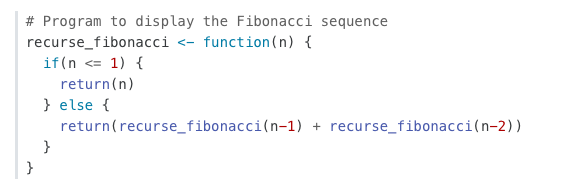

## Terminology

## Link Recommendations

* Use relative paths for child or sibling documents. E.g. `images/fig-1.png`, `pdf-basics.qmd`. **Avoid** using `http://quarto.org` for internal links.
* Prefer absolute paths from the root of the project over relative paths involving `../`. E.g. use `/docs/output-formats/html-themes.qmd`, not `../output-formats/html-themes.qmd`. 
    * Possible exception: documents in a subfolder of a section that link to the section root, e.g. you may use `../index.qmd` to refer to `docs/manuscripts/index.qmd` from `docs/manuscripts/authoring/index.qmd`.  
* Use `.qmd` instead of `.html`. E.g. use `content.qmd#editing-tables`, not `content.html#editing-tables` 
    * Possible exception: links in blog posts

## Images and Alt Text

Every image needs alt text, or an explicit `fig-alt=""` if it is decorative. A screen reader reads the alt text in place of the image.

### Use `fig-alt`

Use `fig-alt` for every image. It works on images with and without captions, on images in tables and in running text, and on code cells.

```markdown
{fig-alt="The visual editor toolbar."}

{fig-alt="The visual editor toolbar."}
```

Text in the square brackets is a visible caption, not alt text. Always give the alt text in `fig-alt`, also when the image has a caption.

For a code cell, use `#| fig-alt:`. If the cell makes more than one plot, give a list with one item for each plot:

```r
#| fig-alt:
#|   - "Histogram of highway mileage."
#|   - "Scatterplot of highway mileage against engine size."
```

### Write for the purpose of the section

Before you write the alt text, find out what the section teaches.

* **The image is the lesson.** For example, a screenshot of a feature, or the output of an option. Describe what the reader must see to follow the text. One or two sentences is usually enough.
* **The image is a stand-in.** For example, kitten photos in a demo of `.absolute` positioning, or a plot in a demo of `echo: true`. A short label is enough: "Tabby kitten", "Spiral polar plot".
* **The image is decoration, or it repeats the text next to it.** Use `fig-alt=""`.
* **The image is an icon for a UI control.** Give the name of the control in bold text, then show the icon with an icon font and `aria-hidden="true"`. For example: `**Slide menu** button <i class="bi bi-list" aria-hidden="true"></i>`. Do not use an image of the icon.

Rules for the text itself:

* Do not start with "Image of" or "Picture of".
* Do not use Markdown in alt text. Backticks and asterisks show as literal characters.
* Use the same words as the prose for the same thing.
* Give the same image the same alt text everywhere it appears. Before you write new alt text, search for other uses of the image and reuse the alt text that is there. Two files with the same name are not always the same image, so look at both.
* For a light and dark pair (`.light-content` and `.dark-content`), give both images the same alt text.
* In an include file (`_*.md`), use the same `` values in the alt text that the image path uses. Then the alt text is correct on every page that includes the file.

### Keep examples in sync with their output

Many pages show example code and also its result. The code can come from the source file (a `code-preview` block or an `echo: fenced` cell). It can also be a separate copy in its own code block, usually near the result, sometimes on a different page. In all cases, the code that readers see must match the source of the result, `fig-alt` included. When you edit one, find and edit the others.

To find copies, search the code blocks on the site for the image file name or for a distinctive line of the example.

When readers can see the `fig-alt` in the code, it is part of the lesson. Keep it short, so that it does not distract from the lesson.

Some examples must not have alt text. For example, an example that shows what Quarto does when alt text is missing. In that case, leave out alt text in both places. Then add a comment next to the example, so that the next person does not "correct" it:

```markdown
<!-- a11y: no alt on purpose. This example shows the output without alt text. -->
```

### Images that `fig-alt` cannot fix

Some images come from Quarto options, not from Markdown:

* Navbar and sidebar logos: use `logo-alt`.
* The Revealjs `logo`: use the object form, `logo: {path: quarto.png, alt: "Quarto logo"}`.
* For other options, look in the Quarto schema. Follow each `ref:` to its definition, because some `alt` properties are in nested objects.

Charts that JavaScript draws (for example, Altair and Vega-Lite) do not make an ``, so `fig-alt` has no effect on them. Record these as a separate problem.

### Check the result

Render the page. Then make sure that each `` in the output has an `alt` attribute:

```bash
quarto render docs/path/to/page.qmd
grep -o ']*>' _site/docs/path/to/page.html
```

Do this check also when an axe scan of the page shows no problems. Axe does not examine images on hidden slides or in tabs that are not open, but these images also need alt text.

If the page has a `_freeze/` entry, update the freeze too. See [README.md](README.md).

## Toolbar Icons

When prose points to a button or other control in a user interface:

* Name the control in bold. Use the name the control shows: its label, its tooltip, or its accessible name. Screen reader users hear this name, and voice control users say it.
* Add "button" after the name if the control is a button.
* Put the icon image after the name, with `alt=""` and the `.ui-icon` class. The name is already in the text, so the image is decorative.
* Do not use `<kbd>` for the icon or the name. `<kbd>` is for keyboard input.

```markdown
Use the **Render** button {.ui-icon alt="" width="25" height="20"} in RStudio.
```

The `.ui-icon` class (`theme.scss` and `theme-dark.scss`) gives the image the same key-cap look as `<kbd>` in the light and dark themes.

## Headings and Example Labels

Use a heading only when it starts a section. A section continues until the next heading of the same level or higher. Screen readers use headings to move through a page, and the page TOC lists them.

Do not skip heading levels. After `##`, the next level is `###`.

A short label for one example is a caption, not a heading. Labels such as "Markdown Syntax", "Output", "HTML output", and "Arrow (light)" are captions. If you use a heading for a caption, the text after the example becomes part of the caption's section. This is incorrect when that text applies to the whole section.

Use one of these patterns for a caption:

* For a code block, use the `filename` attribute. The label shows in the header of the block.

  ````markdown
  ``` {.markdown filename="Markdown Syntax"}
  | Right | Left |
  |------:|:-----|
  ```
  ````

* For an image, use the image caption. The caption becomes a `<figcaption>` for the image. If a page shows several captioned images in a sequence, set `fig-cap-location: top` in the page front matter. Then each caption is directly above its image.

  ```markdown
  {fig-alt="A block of code showcasing the Arrow (light) theme."}
  ```

* For rendered output that follows its source, write a lead-in sentence, for example "This renders as:".

* For a set of source and output pairs, use a table with `Markdown Syntax` and `Output` column headers. See "Other Blocks" in `docs/authoring/markdown-basics.qmd`.

* For output that has no other pattern, use a bold label paragraph, for example `**PDF output**`.

Do not add `{.unlisted}` to a heading to hide a caption from the TOC. The heading is still in the page structure.
