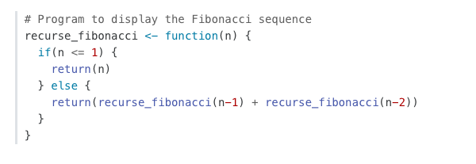
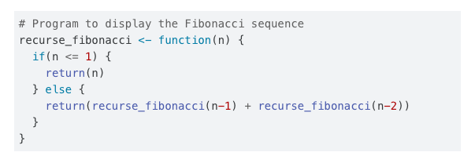
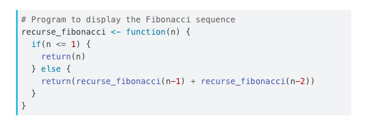
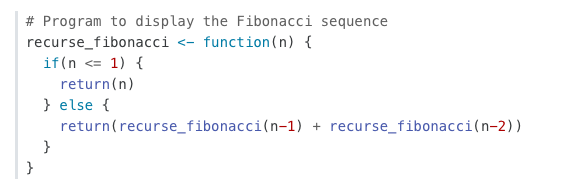
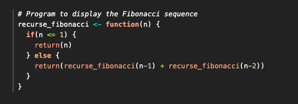
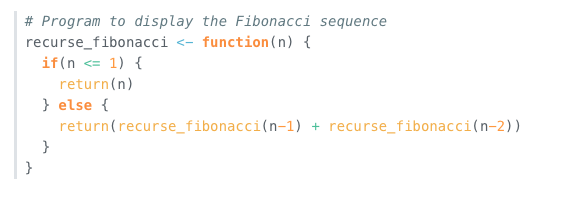
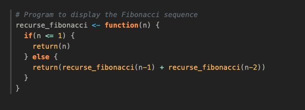

::: {.callout-tip}
## Learn more
See the full guide on [HTML Code Blocks](https://quarto.org/docs/output-formats/html-code.html) and [Callout Blocks](https://quarto.org/docs/authoring/callouts.html).
:::

## Floating TOC

The HTML format by default uses a floating table of contents which can be customized using the following:

``` {.yaml}
format:
  html:
    toc: true
    toc-float: true
    toc-title: Contents
```

The floating table of contents can be used to navigate to sections of the document and also will automatically highlight the appropriate section as the user scrolls. The table of contents is responsive and will become hidden once the viewport becomes too narrow. See an example on the right of this page.

## Tabsets

### Example

Tabsets as such:

::: {.tabset}
## R

``` {.r}
fizz_buzz <- function(num_array=seq_len(100L)) {
  result_array <- Map(function(r,n){cat(paste0(ifelse(r=='',n,r),'\n'))},
                      r=paste0(ifelse(num_array%%3L,'','Fizz'),
                                 ifelse(num_array%%5L,'','Buzz')),
                      n=num_array)
}
```

## Python

``` {.python}
def fizz_buzz(num):
  if num % 15 == 0:
    print("FizzBuzz")
  elif num % 5 == 0:
    print("Buzz")
  elif num % 3 == 0:
    print("Fizz")
  else:
    print(num)
```

## Java

``` {.java}
public class FizzBuzz
{
  public static void fizzBuzz(int num)
  {
    if (num % 15 == 0) {
      System.out.println("FizzBuzz");
    } else if (num % 5 == 0) {
      System.out.println("Buzz");
    } else if (num % 3 == 0) {
      System.out.println("Fizz");
    } else {
      System.out.println(num);
    }
  }
}
```

## Julia

``` {.julia}
function FizzBuzz(num)
  if num % 15 == 0
    println("FizzBuzz")
  elseif num % 5 == 0
    println("Buzz")
  elseif num % 3 == 0
    println("Fizz")
  else
    println(num)
  end
end
```
:::

### Markdown

The example is implemented using markdown like:

```` {.markdown}
::: {.tabset}
## R

``` {.r}
fizz_buzz <- function(num_array=seq_len(100L)) {
  result_array <- Map(function(r,n){cat(paste0(ifelse(r=='',n,r),'\n'))},
                      r=paste0(ifelse(num_array%%3L,'','Fizz'),
                                 ifelse(num_array%%5L,'','Buzz')),
                      n=num_array)
}
```

## Python

``` {.python}
def fizz_buzz(num):
  if num % 15 == 0:
    print("FizzBuzz")
  elif num % 5 == 0:
    print("Buzz")
  elif num % 3 == 0:
    print("Fizz")
  else:
    print(num)
```

:::
````


## Callouts

Callouts are an excellent way to draw extra attention to certain concepts, or to more clearly indicate that certain content is supplemental or applicable to only some scenarios. Here are some examples of callouts:

::: {.callout-warning}
Callouts provide a simple way to attract attention, for example, to this warning.
:::

::: {.callout-important}
## This is Important

Danger, callouts will really improve your writing.
:::

::: {.callout-note}
Note that there are five types of callouts, including: `note`, `tip`, `warning`, `caution`, and `important`.
:::

::: {.callout-tip}
## Tip With Caption

This is an example of a callout with a caption.
:::

::: {.callout-caution collapse="true"}
## Expand To Learn About Collapse

This is an example of a 'collapsed' caution callout that can be expanded by the user. You can use `collapse="true"` to collapse it by default or `collapse="false"` to make a collapsible callout that is expanded by default.
:::

Create callouts in markdown using the following syntax (note that the first markdown heading used within the callout is used as the callout heading):

``` {.markdown}
:::{.callout-note }
Note that there are five types of callouts, including:
`note`, `tip`, `warning`, `caution`, and `important`.
:::

:::{.callout-tip}
## Tip With Caption

This is an example of a callout with a caption.
:::

:::{.callout-caution  collapse="true"}
## Expand To Learn About Collapse

This is an example of a 'folded' caution callout that can be expanded by the user. You can use `collapse="true"` to collapse it by default or `collapse="false"` to make a collapsible callout that is expanded by default.
:::
```

Callouts are rendered in HTML as illustrated above. In PDF output the [awesomebox](https://ctan.org/pkg/awesomebox?lang=en) LaTeX package is used for callouts. Callouts currently receive no special treatment in EPUB or MS Word output.


## Code Blocks

By default code blocks are rendered with a left border whose color is derived from the currently theme. You can customize code chunk appearance with some simple options that control the background color and left border. Options can either be booleans to enable or disable the treatment or can be legal CSS color strings (or they could even be SASS variable names!).

### Appearance

Here is the default appearance for code blocks (note the border at left and no background highlighting):



You can add a background using the `code-background` option:

```yaml
code-background: true
```



You can combine a background and border treatment as well as customize the left border color:

``` {.yaml}
code-background: true
code-border-left: "#31BAE9"
```




### Highlighting

You can specify the code highlighting style using `highlight-style` and specifying one of the supported themes. Supported themes include all the themes included in Pandoc (pygments, tango, espresso, zenburn, kate, monochrome, breezedark, haddock) as well as an additional set of extended themes here:

<https://github.com/quarto-dev/quarto-cli/tree/main/src/resources/pandoc/highlight-styles>

For example:

```{.yaml}
highlight-style: github
```

Highlighting themes can provide either a single highlighting definition or two definitions, one optimized for a light colored background and another optimized for a dark color background. When available, Quarto will automatically select the appropriate style based upon the code chunk background color's darkness. Users may always opt to specify the full name (e.g. `atom-one-dark`) to by pass this automatic behavior.

By default, code is highlighted using the `arrow` theme. We've additionally introduced the `arrow-dark` theme which is designed to provide beautiful, accessible highlighting against dark backgrounds.

Examples of the light and dark themes:

#### Arrow (light)

{}

#### Arrow (dark)



#### Ayu (light)



#### Ayu (dark)



## Responsive Figures

If an image does not include an explicitly set height, it will automatically become responsive. Try resizing the browser and note how the image below grows and shrinks.

```{r pressure, echo=FALSE, fig.cap="Under Pressure"}
plot(pressure)
```
