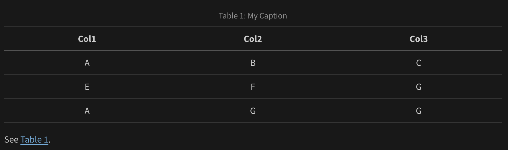

For markdown tables, add a caption below the table, then include a `#tbl-` label in braces at the end of the caption. For example:

``` markdown
| Col1 | Col2 | Col3 |
|------|------|------|
| A    | B    | C    |
| E    | F    | G    |
| A    | G    | G    |

: My Caption {#tbl-letters}

See @tbl-letters.
```

Which looks like this when rendered to HTML:

::: light-content
{fig-alt="A table with 3 columns and four rows. The text 'Table 1: My Caption' is above the header column. The text 'See tbl. 1' is aligned to the left underneath the last column." width="100%"}
:::

::: dark-content
{fig-alt="A table with 3 columns and four rows. The text 'Table 1: My Caption' is above the header column. The text 'See tbl. 1' is aligned to the left underneath the last column." width="100%"}
:::