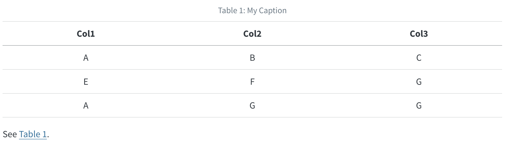

For markdown tables, add a caption below the table, then include a `#tbl-` label in braces at the end of the caption. For example:

``` markdown
| Col1 | Col2 | Col3 |
|------|------|------|
| A    | B    | C    |
| E    | F    | G    |
| A    | G    | G    |

: My Caption {#tbl-letters}

See @tbl-letters.
```

Which looks like this when rendered to HTML:

{fig-alt="A table with 3 columns and four rows. The text 'Table 1: My Caption' is above the header column. The text 'See tbl. 1' is aligned to the left underneath the last column." width="500"}


### Subtables

You may want to create a composition of several sub-tables. To do this, create a div with a main identifier, then apply sub-identifiers (and optional caption text) to the contained tables. For example:

``` markdown
::: {#tbl-panel layout-ncol=2}
| Col1 | Col2 | Col3 |
|------|------|------|
| A    | B    | C    |
| E    | F    | G    |
| A    | G    | G    |

: First Table {#tbl-first}

| Col1 | Col2 | Col3 |
|------|------|------|
| A    | B    | C    |
| E    | F    | G    |
| A    | G    | G    |

: Second Table {#tbl-second}

Main Caption
:::

See @tbl-panel for details, especially @tbl-second.
```

Which looks like this when rendered to HTML:

{fig-alt="Two tables side-by-side. Both tables have 3 columns and 4 rows. The table on the left is titled '(a) First table'. The table on the right is titled '(b) Second Table'. Centered underneath both tables is the text 'Table 1: Main Caption'. The text 'See tbl. 2 for details, especially tbl. 2 (b)' is aligned to the left underneath that."}

Note that the "Main Caption" for the table is provided as the last block within the containing div.
