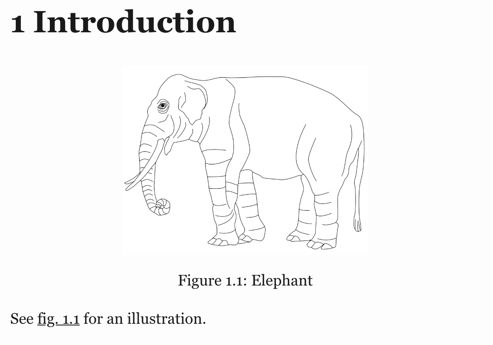

## Overview 

There are a wide variety of options available for customizing caption labels and references. These options are all specified within the `crossref` key of document metadata.

On this page we highlight some of the most useful, but you can find all available `crossref` options on the [Cross-Reference Options](/docs/reference/metadata/crossref.qmd) reference page.

::: {.callout-note appearance="simple"}
Note that since LaTeX does its own formatting and layout of figures and tables, not all of these options will apply when rendering to PDF. Specifically, delimiter options like `title-delim` and numbering options like `labels` don't work for PDF output. Additionally, formatting directives are not applied (e.g. italicizing the figure title) for LaTeX titles.
:::

## Titles

You can specify the title prefix used for captions using `*-title` options. You can also specify the delimiter used between the prefix and the caption using the `title-delim` option. For example:

``` yaml
---
title: "My Document"
crossref:
  fig-title: Fig     # (default is "Figure")
  tbl-title: Tbl     # (default is "Table")
  title-delim: "—"   # (default is ":")
---
```

## References {#references}

You can specify the prefix used for inline reference type using `*-prefix` options. You can also specify whether references should be hyper-linked using the `ref-hyperlink` option. For example:

``` yaml
---
title: "My Document"
crossref:
  fig-prefix: figure   # (default is "Figure")
  tbl-prefix: table    # (default is "Table")
  ref-hyperlink: false # (default is true)
---
```

## Localisation

The `crossref:` keys above override caption titles and reference prefixes for the current document and are language-independent.
For locale-aware overrides, set the corresponding `crossref-{type}-title` and `crossref-{type}-prefix` keys under `language:` instead.
These keys plug into Quarto's localisation system, can be scoped per target language, and can live in a project-level `_language.yml` file.

For example, the Spanish equivalent of the snippets above is:

``` yaml
---
title: "Mi Documento"
lang: es
language:
  crossref-fig-title: "Figura"
  crossref-tbl-title: "Tabla"
  crossref-fig-prefix: "fig."
  crossref-tbl-prefix: "tbl."
---
```

The same `language:` mechanism applies to callouts and to [custom cross-reference kinds](cross-references-custom.qmd).
See [Cross-Reference Titles and Prefixes](language.qmd#cross-reference-titles-and-prefixes) for the full set of supported keys and the per-language subkeys pattern.

## Numbering

There are a variety of numbering schemes available for cross-references, including:

-   `arabic` (1, 2, 3)

-   `roman` (I, II, III, IV)

-   `roman i` (i, ii, iii, iv)

-   `alpha x` (start from letter 'x')

-   `alpha X` (start from letter 'X')

You can specify the numbering scheme used for all types (other than sub-references) using the `labels` option. For sub-references (e.g. subfigures), you can specify the number scheme using the `subref-labels` option. For example:

``` yaml
---
title: "My Document"
crossref:
  labels: alpha a        # (default is arabic)
  subref-labels: roman i # (default is alpha a)
---
```

If you would like, you can specify the number scheme for a specific type using the `*-labels` options. For example:

``` yaml
---
title: "My Document"
crossref:
  fig-labels: alpha a    # (default is arabic)
  tbl-labels: alpha a    # (default is arabic)
  subref-labels: roman i # (default is alpha a)
---
```

If both `labels` and a type specific label option is provided, the type specific option will override the `labels` option.

## Chapter Numbering

You can use the `crossref: chapters` option to indicate that top-level headings (H1) in your document correspond to chapters, and that cross-references should be sub-numbered by chapter. For example:

``` markdown
---
title: "My Document"
author: "Jane Doe"
number-sections: true
crossref:
  chapters: true
---

# Introduction

{#fig-elephant}

See @fig-elephant for an illustration.
```

{fig-alt="A line drawing of an elephant. Above it is the text '1 Introduction' in large, bold font. The label 'Figure 1.1: Elephant' is centered underneath it. The text 'See fig. 1.1 for an illustration' is aligned to the left underneath that."}