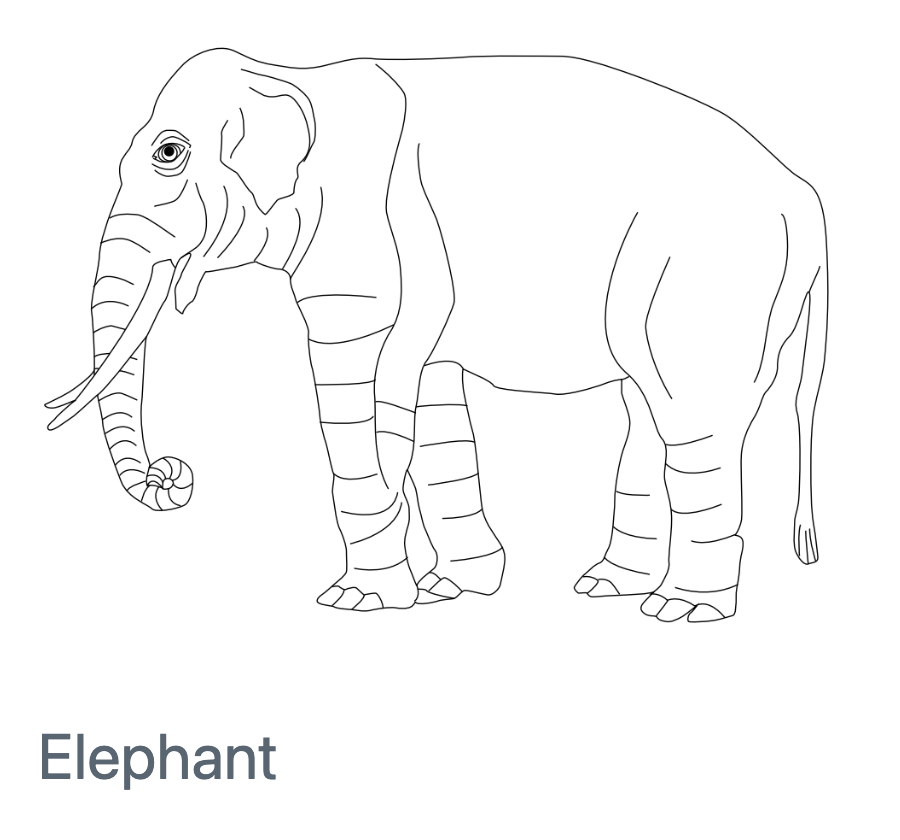
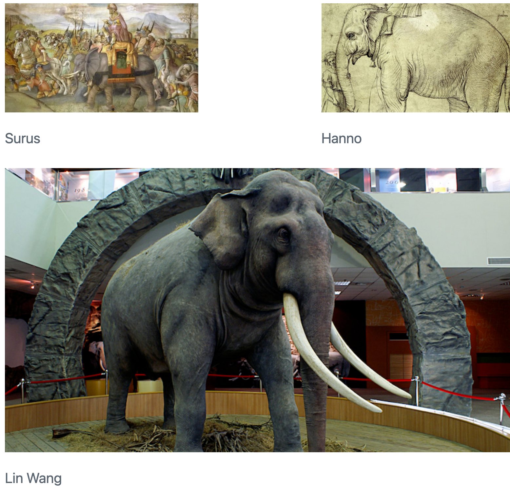
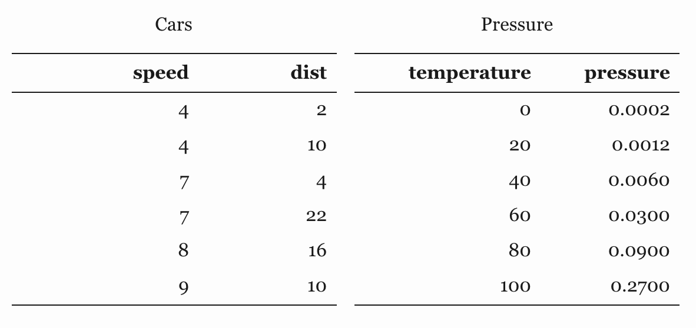

Quarto includes a number of features aimed at making it easier to work with figures and subfigures, as well as for laying out panels that contain multiple figures, tables, or other content.

## Figure Basics

In Pandoc markdown, a figure is created whenever a captioned image appears by-itself in a paragraph. For example:

``` {.markdown}

```

This results in the following treatment for various output types:

| HTML                        | PDF                        | Word                        |
|-----------------------------|----------------------------|-----------------------------|
|  |  |  |

Note that for LaTeX / PDF output figures are automatically numbered (you can arrange for figures to be numbered in other formats using [Cross References](cross-references.html)).

### Linked Figures

When rendering with Quarto, you can enclose a figure within a link and it will still be treated within output as a captioned figure. For example:

``` {.markdown}
[](https://en.wikipedia.org/wiki/Elephant)
```

### Figure Alignment

Figures and their captions are center aligned by default. Add the `fig.align` attribute to the image to use a different alignment. For example:

``` {.markdown}
{fig.align="left"}
```

### LaTeX Environments

There are a number of LaTeX packages that provide custom figure environments. For example, the [mdframed](https://ctan.org/pkg/mdframed?lang=en) package includes an `mdframed` environment used to enclose figures in a special border style. By default, Quarto uses the standard `figure` environment, but you can use the `fig.env` attribute to specify a custom one. For example:

``` {.markdown}
---
title: "Sidenotes"
format:
  pdf:
    header-includes: |
      \usepackage{sidenotes}
---

{fig.env="marginfigure"}
```

## Figure Divs

You can treat any markdown content you want as a figure by enclosing it in Pandoc div block with an identifier prefaced with `#fig-`. For example, here we create a figure that includes an embedded iframe:

``` {.markdown}
::: {#fig-elephant}

<iframe width="560" height="315" src="https://www.youtube.com/embed/SNggmeilXDQ"></iframe>

Elephant
:::
```

Note that the last paragraph in the div block is used as the figure caption.

## Subfigures

If you have several figures that appear as a group, you can create a figure div to enclose them. For example:

``` {.markdown}
::: {#fig-elephants layout.ncol=2}

{#fig-surus}

{#fig-hanno}

Famous Elephants
:::
```

Again, the last paragraph provides the main caption, and the individual figures carry the sub-captions. Here is what this looks like when rendered as HTML:


Note that we also used a `layout.ncol` attribute to specify a two-column layout. The next section delves more into customizing figure layouts.

## Figure Panels

Above we demonstrate laying out two side-by-side figures with subcaptions and a main caption. You may or may not want the caption / sub-caption treatment, and you might also want to use multiple rows of figures. All of these variations are possible.

To layout two figures with their own standalone captions (and no main caption), just eliminate the `#fig` identifiers and main caption at the bottom:

``` {.markdown}
::: {layout.ncol=2}


:::
```


You can also eliminate the captions entirely:

``` {.markdown}
::: {layout.ncol=2}


:::
```

### Multiple Rows

If you have more than 2 images, you might want to lay them out across multiple rows. You can do this using the `layout.nrow` attribute. For example:

``` {.markdown}
::: {layout.nrow=2}


:::
```


More complex figure arrangements (e.g. rows with varying column layouts) are possible. See the [Complex Layouts](#complex-layouts) section below for more details.

## Table Panels

You can also use a div with layout attributes to display tables side-by-side. For example:

``` {.markdown}
::: {layout.ncol=2}
| Col1 | Col2 | Col3 |
|------|------|------|
| A    | B    | C    |
| E    | F    | G    |
| A    | G    | G    |

: First Table

| Col1 | Col2 | Col3 |
|------|------|------|
| A    | B    | C    |
| E    | F    | G    |
| A    | G    | G    |

: Second Table
:::
```


As with figures, you can also present tables using numbered subcaptions by adding a main caption and `#tbl-` identifiers:

``` {.markdown}
::: {#tbl-panel layout.ncol=2}
| Col1 | Col2 | Col3 |
|------|------|------|
| A    | B    | C    |
| E    | F    | G    |
| A    | G    | G    |

: First Table {#tbl-first}

| Col1 | Col2 | Col3 |
|------|------|------|
| A    | B    | C    |
| E    | F    | G    |
| A    | G    | G    |

: Second Table {#tbl-second}

Main Caption
:::
```


See the article on [Cross References](cross-references.html) for additional details on table captions, subcaptions, and numbering.

## Custom Layouts {#complex-layouts}

The examples above used the `layout.ncol` or `layout.nrow` attributes to create straightforward layouts where all columns are of equal sizes. The `layout` attribute enables the creation of much more complex layouts.

For example, this defines a layout with two equally sized figures in the first row, then another image that spans the entire second row:

``` {.markdown}
::: {layout="[[1,1], [1]]"}


:::
```


The `layout` attribute is a 2-dimensional array where the first dimension defines rows and the second columns. In this case `"layout="[[1,1], [1]]"` translates to: create two rows, the first of which has two columns of equal size and the second of which has a single column.

Note that the numbers in a row are arbitrary and don't need to add up to a particular total. You can therefore use whatever scheme is most natural. For example, here we define columns that occupy varying percentage widths of the row:

``` {.markdown}
::: {layout="[[70,30], [100]]"}


:::
```

You can also use negative values to create space between elements. For example:

``` {.markdown}
::: {layout="[[40,-20,40], [100]]"}


:::
```



### Vertical Alignment

If you have a layout with a row of images of differing heights, you can control their vertical alignment using the `layout.valign` attribute. A simple example:

``` {.markdown}
::: {layout="[25,-2,10]" layout.valign="bottom"}


:::
```


Note that vertical alignment isn't limited to images, you can also vertically align any other elements that are included in a panel.

## Computations

### Figures

Note that figure layout attributes also work for figures produced by executable code blocks. Here are examples for both Jupyter and Knitr:

::: {.tabset}
#### Jupyter

```` {.python}
```{python} 
#| layout.ncol: 2

import matplotlib.pyplot as plt
plt.plot([1,23,2,4])
plt.show()

plt.plot([8,65,23,90])
plt.show()
```
````


#### Knitr

```` {.python}
```{r}
#| layout.ncol: 2

plot(cars)
plot(pressure)
```
````


:::

### Tables

You can also use layout attributes for tables produced by Knitr or Jupyter. For example, this Rmd code chunk creates side-by-side tables:

```` {.python}
```{r}
#| layout.ncol: 2

library(knitr)
kable(head(cars), caption = "Cars")
kable(head(pressure), caption = "Pressure")
```
````



### Custom Layout

The `layout` works the same way for figures or tables produced by knitr or Jupyter. For example, here's an Rmd code chunk that produces 3 plots and defines a custom layout for them:

```` {.python}
```{r}
#| layout: [[45,-10, 45], [100]]

plot(cars)
plot(pressure)
plot(mtcars)
```
````


## Block Layout

While the examples above illustrate laying out figures and tables, it's important to note that layout attributes can be used to layout any sort of block content. For example, here we layout 2 lists side-by-side:

``` {.markdown}
::: {layout.ncol=2}
### List One

- Item A
- Item B
- Item C

### List Two

- Item X
- Item Y
- Item Z
:::
```

Note that headings are automatically combined with the block that follows them, so this markdown has a total of 2 columns to lay out. Here's an example of a paragraph next to a bullet list (without headings):

``` {.markdown}
::: {layout.ncol=2}
- Item X
- Item Y
- Item Z

Lorem ipsum dolor sit amet, consectetur adipiscing elit. Curabitur gravida eu erat et fring. Morbi congue augue vel eros ullamcorper, eget convallis tortor sagittis. Fusce sodales viverra mauris a fringilla. Donec feugiat, justo eu blandit placerat, enim dui volutpat turpis, eu dictum lectus urna eu urna. Mauris sed massa ornare, interdum ipsum a, semper massa. 
:::
```
