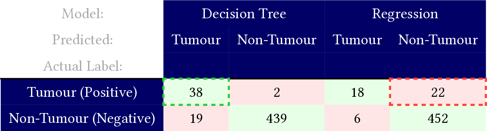
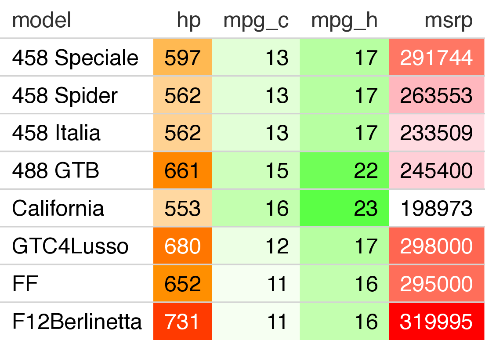
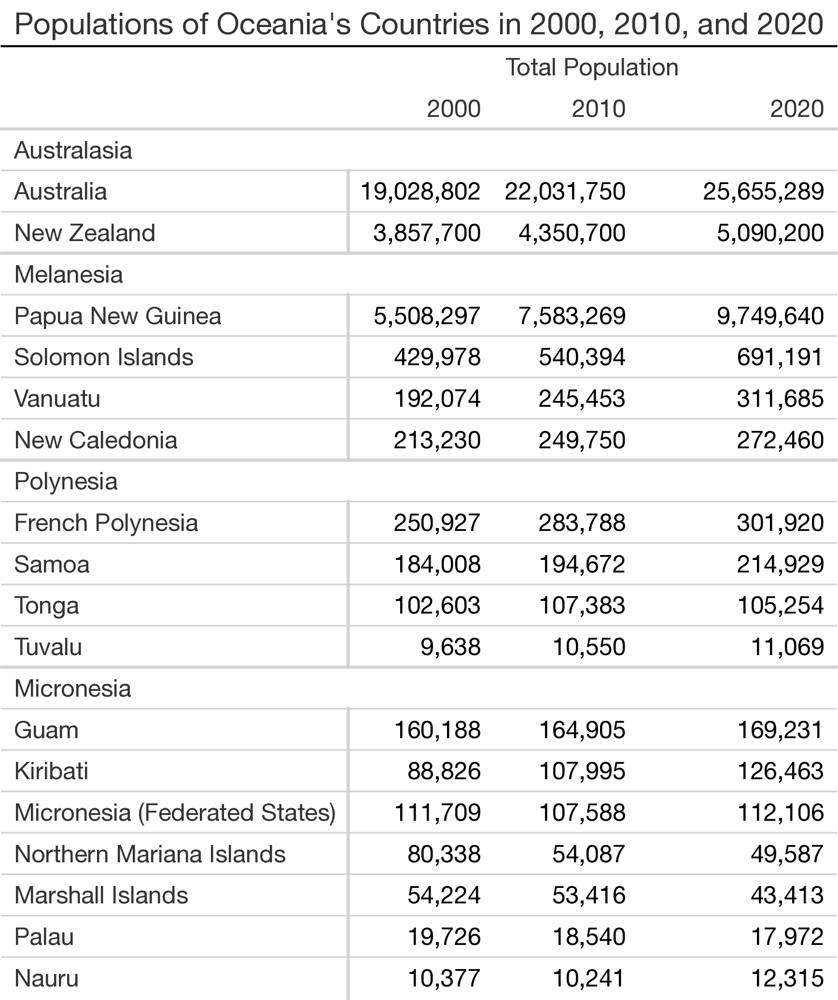
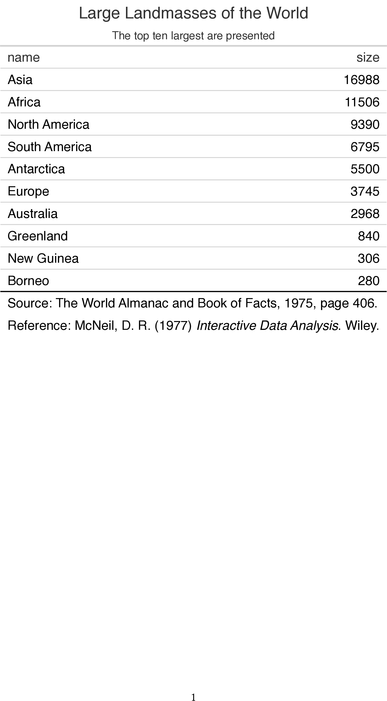

Quarto now allows HTML Tables with CSS styling to be output in Typst.

It does this by translating CSS properties into Typst properties. You can read about the feature [in the Guide](/docs/output-formats/typst.qmd#typst-css).[technical details [in the Advanced Docs](/docs/advanced/typst/typst-css.qmd)]{.aside}

Today let's look at some beautiful, expressive HTML tables that also look great in Typst! In all examples, the snapshot on the left is Typst, and the HTML version is on the right.

Here is a confusion matrix drawn with Pandas in Python. 

::::: {.column-page .room}
:::: {.columns}
::: {.column width="50%" style="padding-top:.5em"}
{width=520}
:::
::: {.column width="50%"}
```{=html}
<iframe class="html-demo" src="demo/pandas-confusion-matrix.html" width=481 height=171></iframe>
```
:::
::::
:::::

Here is a nice use of cell background colors to draw a heatmap on a table of the familiar cars dataset.

::::: {.column-page .room}
:::: {.columns}
::: {.column width="50%" style="padding-top:1.5em"}
{width=430}
:::
::: {.column width="50%"}
```{=html}
<iframe class="html-demo" src="demo/gt-cars.html" width=430 height=380></iframe>
```
:::
::::
:::::


Borders can help with organization of tables that have more structure than just rows and columns. Here's an example of populations grouped by subregion, using Great Tables.

::::: {.column-page .room}
:::: {.columns}
::: {.column width="50%" style="padding-top:1.5em"}
{width=600}
:::
::: {.column width="50%"}
```{=html}
<iframe class="html-demo" src="demo/great-tables-oceania.html" width=600 height=910></iframe>
```
:::
::::
:::::

Typst CSS misses one border here, because Great Tables is doing something extra-fancy. But it still looks pretty good!

And here's a simple continent area table from gt.

::::: {.column-page .room}
:::: {.columns}
::: {.column width="50%" style="padding-top:2.5em"}
{width=500}
:::
::: {.column width="50%"}
```{=html}
<iframe class="html-demo" src="demo/gt-islands.html" width=400 height=600></iframe>
```
:::
::::
:::::
