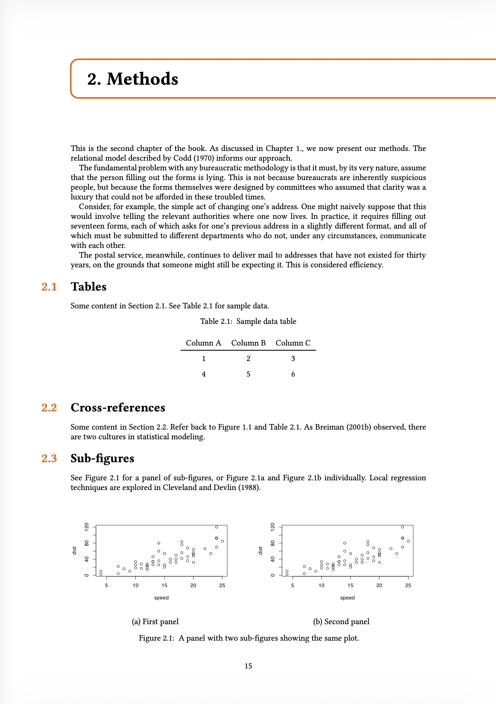
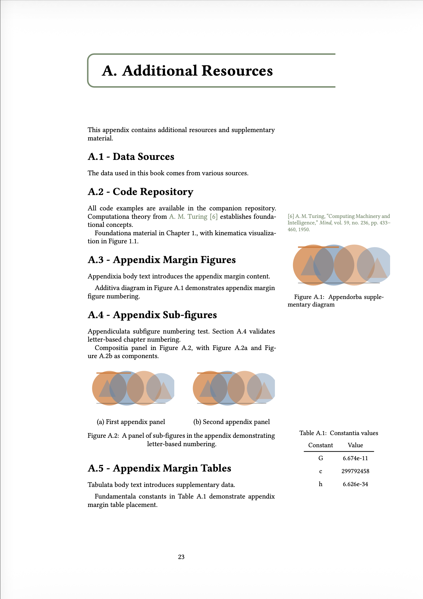

Typst is a lightning-fast typesetting system that provides a modern alternative to LaTeX. 

The Typst ecosystem is thriving, and Quarto 1.9 brings Typst much closer to feature parity with LaTeX:

* Typst books
* Article layout in Typst
* Bundling of Typst packages for offline rendering

## Typst books

In Quarto 1.9, a project with type `book` and format `typst` is now rendered as a single document with multiple chapters and other book content.

``` {.yaml filename="_quarto.yml"}
project:
  type: book

book:
  title: "My Book"
  author: "Jane Doe"
  chapters:
    - index.qmd
    - intro.qmd
    - summary.qmd

format: typst
```



All book features previously available in the LaTeX format are now available in Typst:

* Parts and Chapters
* Appendices
* Cross-references and chapter-based numbering
* Table of Contents

List-of-Figures and List-of-Tables support is [coming soon](https://github.com/quarto-dev/quarto-cli/issues/14081).

The default Typst book uses the bundled Quarto [quarto-orange-book](https://github.com/quarto-ext/orange-book) extension, which itself [bundles](#typst-gather) the Typst [orange-book](https://typst.app/universe/package/orange-book) package. Orange-book provides a textbook-style layout with colored chapter headers and sidebars.

Since Typst books are implemented as Quarto [Format Extensions](/docs/extensions/formats.qmd), you can customize the appearance by creating your own extension. Typst partials define the overall book structure, while Lua filters handle the necessary AST transformations.

## Article layout in Typst

Also in Quarto 1.9, all [Article Layout](/docs/authoring/article-layout.qmd) features now work in Typst, via the Typst [Marginalia](https://typst.app/universe/package/marginalia/) package.

Specifically:

* Figures, tables, code listings, and equations can be placed in the margin using the `.column-margin` class, or the `column: margin` code cell option. You can also target specific output types with `fig-column: margin` or `tbl-column: margin`.
* Figure, table, and code listing captions can be placed in the margin with `cap-location: margin` (or `fig-cap-location: margin` and `tbl-cap-location: margin` for specific types).
* Footnotes and citations can be displayed in the margin with `reference-location: margin` and `citation-location: margin`. When margin citations are enabled, the bibliography is suppressed.
* Asides (`.aside` class) place content in the margin without a footnote number.


::: {.callout-warning}
## Books with article layout are functional, but need work
You can combine book and article layout, but the page layout is not perfect, so we will not show screenshots here. It is perfectly functional and will not require any further changes to Quarto, but Marginalia needs to be integrated into the book template. 

We will work with the orange-book author to improve the default book template.
:::




## `typst-gather`

Quarto 1.9 automatically stages Typst packages — from your extensions, from Quarto's bundled extensions, and from Quarto itself — into the `.quarto/` cache directory before calling `typst compile`. This means Typst documents render offline without needing network access.

To make this work, extension authors use the new [`typst-gather`](/docs/advanced/typst/typst-gather.qmd) tool, which scans their `.typ` files for `@preview` imports and downloads the packages into the extension directory. Authors run `quarto call typst-gather` and commit the results — users of the extension don't need to do anything.

This means [Custom Typst Formats](/docs/output-formats/typst-custom.qmd#custom-formats) can depend on Typst packages without copying and pasting Typst code, making them simpler and easier to maintain.
