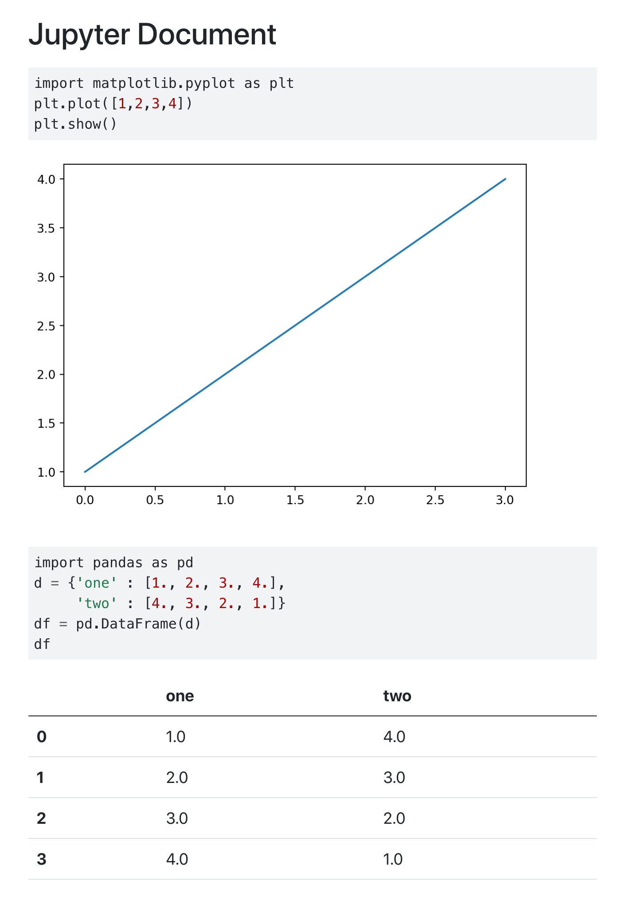

## Overview

Quarto supports embedding computations within markdown. This allows you to create fully reproducible documents and reports---the code required to produce your output is part of the document itself, and is automatically re-run whenever the document is rendered.

There are currently two engines supported for running computations:

-   [Jupyter](https://jupyter.org/), for embedding code from Python, Julia, and many other languages.

-   [Knitr](https://yihui.org/knitr/), for embedding code from R.

Extensive customization of code chunk output is supported, including the ability to hide code and/or output as well as fold code (make it visible only on demand).

## Executable Code

Code blocks that use braces around the language name (e.g. ```` ```{python} ````) are executable, and will be run by Quarto during render. Here are a couple of simple examples in Python and R to illustrate (the output produced by the code block is shown beneath the code).

### Python (Jupyter)

```` {.python}
---
title: "Jupyter Document"
format: 
  html:
    code-background: true
jupyter: python3
---

```{python}
import matplotlib.pyplot as plt
plt.plot([1,2,3,4])
plt.show()
```

```{python}
import pandas as pd
d = {'one' : [1., 2., 3., 4.],
     'two' : [4., 3., 2., 1.]}
df = pd.DataFrame(d)
df
```
````

{.border}

Note that we added the `code-background: true` option to provide a background color for the code chunks (see the documentation on [Code Block](../output-formats/html-extensions.Rmd#code-blocks) options for additional details on customizing code block output).

### R (Knitr)

```` {.r}
---
title: "Knitr Document"
format: 
  html:
    code-background: true
execute:
  warning: false
---

```{r}
library(ggplot2)
ggplot(airquality, aes(Temp, Ozone)) + 
        geom_point() + 
        geom_smooth(method = "loess", se = FALSE)
```

```{r}
summary(airquality)
```
````

{.border}

Note that we added the `execute: warning: false` option to suppress printing of warnings. See the [Execution Options] section below for additional details.

You can produce a wide variety of output types from executable code blocks, including:

-   Static plots (e.g. from matplotlib or ggplot2).

-   Interactive plots (e.g. from plotly or leaflet).

-   Tabular output (e.g. from printing R or Pandas data frames)

-   Plain text output (e.g. printing the results of statistical summaries).

### Non-Executable Blocks

Note that code blocks that use convential markdown code block syntax (either ```` ```python ```` or ```` ```{.python} ````) are not executable:

+-------------------+-------------+
| Code Block Syntax | Executable? |
+===================+:===========:+
|     ```{python}   | Yes         |
|     1 + 1         |             |
|     ```           |             |
+-------------------+-------------+
|     ```python     | No          |
|     1 + 1         |             |
|     ```           |             |
+-------------------+-------------+
|     ```{.python}  | No          |
|     1 + 1         |             |
|     ```           |             |
+-------------------+-------------+

Non-executable code blocks are printed but not executed.

## Formats and Tools

Quarto will automatically run computations in any markdown document that contains executable code blocks. For example, the Python example shown above might be rendered with:

``` {.bash}
$ quarto render jupyter-document.qmd
```

The R example might have been rendered with:

``` {.bash}
$ quarto render knitr-document.Rmd
```

::: {.callout-note}
Note that while the .Rmd extension is not required for using the Knitr engine (you could instead use .qmd), it's still recommended that you use .Rmd since many editors (e.g. RStudio) will make features like interactive chunk execution available when the .Rmd extension is present. See the article on [Using RStudio](using-rstudio.md) for additional details.
:::

Note that while the Python example above uses a markdown file, Quarto can also render any Jupyter notebook (.ipynb) and use all of the same computational features described here. For example:

``` {.bash}
$ quarto render jupyter-document.ipynb
```

::: {.callout-note}
Jupyter users have a choice of authoring in .ipynb (and using the JupyterLab or VS Code notebook editor) or authoring in plain text markdown using their favorite text editor. See the article on [Using Jupyter Lab](using-jupyter-lab.md) for additional details.

You can convert between notebook (.ipynb) and markdown (.qmd) representations of a document using the `quarto convert` command (see `quarto convert help` for details).
:::

## Execution Options

### Output

There are a wide variety of options available for customizing output from executed code. All of these options can be specified either globally (in the document front-matter) or per code-block. For example, here's a modification of the Python example to specify that we don't want to "echo" the code into the output document:

``` {.yaml}
---
title: "My Document"
execute:
  echo: false
jupyter: python3
---
```

Note that we can override this option on a per code-block basis. For example:

```` {.python}
```{python}
#| echo: true

import matplotlib.pyplot as plt
plt.plot([1,2,3,4])
plt.show()
```
````

Code block options are included in a special comment at the top of the block (lines at the top prefaced with `#|` are considered options).

Options available for customizing output include:

+-----------+----------------------------------------------------------------------------------------------------------------------------------------------+
| Option    | Description                                                                                                                                  |
+===========+==============================================================================================================================================+
| `eval`    | Evaluate the code chunk (if `false`, just echos the code into the output).                                                                   |
+-----------+----------------------------------------------------------------------------------------------------------------------------------------------+
| `echo`    | Include the source code in output                                                                                                            |
+-----------+----------------------------------------------------------------------------------------------------------------------------------------------+
| `output`  | Include the results of executing the code in the output                                                                                      |
+-----------+----------------------------------------------------------------------------------------------------------------------------------------------+
| `warning` | Include warnings in the output.                                                                                                              |
+-----------+----------------------------------------------------------------------------------------------------------------------------------------------+
| `error`   | Include errors in the output (note that this implies that errors executing code will not halt processing of the document).                   |
+-----------+----------------------------------------------------------------------------------------------------------------------------------------------+
| `include` | Catch all for preventing any output (code or results) from being included (e.g. `include: false` suppresses all output from the code block). |
+-----------+----------------------------------------------------------------------------------------------------------------------------------------------+

Here's a Knitr example with some of these additional options included:

```` {.markdown}
---
title: "Knitr Document"
execute:
  echo: false
---

```{r}
#| warning: false

library(ggplot2)
ggplot(airquality, aes(Temp, Ozone)) + 
        geom_point() + 
        geom_smooth(method = "loess", se = FALSE)
```

```{r}
summary(airquality)
```
````

### Caching

Quarto integrates with the [Jupyter Cache](https://jupyter-cache.readthedocs.io/en/latest/) and [Knitr Cache](https://bookdown.org/yihui/rmarkdown-cookbook/cache.html) to to cache time consuming code chunks. Note that to use Jupyter Cache you'll want to install the `jupyter-cache` package:

``` {.bash}
$ pip install jupyter-cache
```

To enable caching for a document just add the `cache` option:

``` {.yaml}
execute: 
  cache: true
```

You can also use \`quarto\` command line options to control caching behavior without changing the document's code. Use options to force the use of caching on all chunks, disable the use of caching on all chunks (even if it's specified in options), or to force a refresh of the cache even if it has not been invalidated:

``` {.bash}
$ quarto render example.qmd --cache 
$ quarto render example.qmd --no-cache 
$ quarto render example.qmd --cache-refresh 
```

Note that for Jupyter, the cache for a document is invalidated if any of the code blocks change. For Knitr, invalidation occurs on a per-cell basis.

### Disabling Execution

In some cases, you may want to prevent execution entirely. This is especially useful if you author using a standard notebook editor (e.g. JupyterLab) and plan on executing chunks only within the notebook UI. Specify `execute: false` to skip execution when rendering (you'll naturally still get the output that was generated within the notebook editor):

``` {.yaml}
execute: false
```

If you are temporarily disabling execution and don't want to overwrite other `execute` options, you can alternatively just add `enabled: false` to the `execute` options:

``` {.yaml}
execute:
  enabled: false
  echo: true
  warning: false
```

### Jupyter Daemon

To mitigate the \~ 2 second start-up time for the Jupyter Python kernel (and potentially much longer start-up times for other kernels), Quarto keeps a daemon with a running Jupyter kernel for each document rendered interactively. This enables subsequent renders to proceed immediately without having to wait for kernel start-up.

::: {.callout-note}
No daemon is created when documents are rendered without an active tty or when they are part of a batch rendering (e.g. in a [Quarto Project](../getting-started/quarto-projects.md)).
:::

You can customize this behavior using the `daemon` execution option. Set it to `false` to prevent the use of a daemon, or set it to a value (in seconds) to determine the period after which the daemon will timeout (the default is 300 seconds). For example:

``` {.markdown}
execute:
  daemon: false
```

``` {.markdown}
execute:
  daemon: 60
```

You can also force an existing daemon to restart using the `--execute-daemon-restart` command line flag to `quarto render`:

``` {.bash}
$ quarto render document.ipynb --execute-daemon-restart 
```

### Intermediates

On the way from markdown input to final output, there are some intermediate files that are created and automatically deleted at the end of rendering. You can use the following options to keep these intermediate files:

+--------------+------------------------------------------------------------------------------------------------+
| Option       | Description                                                                                    |
+==============+================================================================================================+
| `keep-md`    | Keep the markdown file generated by executing code.                                            |
+--------------+------------------------------------------------------------------------------------------------+
| `keep-ipynb` | Keep the notebook file generated from executing code (applicable only to markdown input files) |
+--------------+------------------------------------------------------------------------------------------------+

For example, here we specify that we want to keep both the markdown intermediate file after rendering:

``` {.markdown}
---
title: "My Document"
execute:
  keep-md: true
jupyter: python3
---
```

## Engine Options {#engine-binding}

### Jupyter Kernel

The Jupyter kernel is determined using the `jupyter` metdata option. For example, to use the [Xeus Python](https://github.com/jupyter-xeus/xeus-python) kernel, do this:

``` {.markdown}
---
title: "My Document"
jupyter: xpython
---
```

Note that you can also provide a full `kerenlspec`, for example:

``` {.markdown}
---
title: "My Document"
jupyter: 
  kernelspec:
    name: "xpython"
    language: "python"
    display_name: "Python 3.7 (XPython)"
---
```

If no Jupyter kernel is specified, then the kernel is determined by finding an available kernel that supports the language of the first executable code block found within the file (e.g. ```` ```{python} ````).

### Engine Binding

Earlier we said that the engine used for computations was determined automatically. You may want to customize this---for example you may want to use the Jupyter [R kernel](https://github.com/IRkernel/IRkernel) rather than Knitr, or you may want to use Knitr with Python code (via [reticulate](https://rstudio.github.io/reticulate/)).

Here are the basic rules for automatic binding:

+-------------------+----------------------------------------------------------------------------------------------------------------------------------------------------------------------------------------------------------------+
| File Type         | Engine Binding                                                                                                                                                                                                 |
+===================+================================================================================================================================================================================================================+
| .md               | Plain markdown (no engine)                                                                                                                                                                                     |
+-------------------+----------------------------------------------------------------------------------------------------------------------------------------------------------------------------------------------------------------+
| .ipynb            | Jupyter engine                                                                                                                                                                                                 |
+-------------------+----------------------------------------------------------------------------------------------------------------------------------------------------------------------------------------------------------------+
| .Rmd              | Knitr engine                                                                                                                                                                                                   |
+-------------------+----------------------------------------------------------------------------------------------------------------------------------------------------------------------------------------------------------------+
| .qmd              | Use Knitr engine if an `{r}` code block is discovered within the file                                                                                                                                          |
|                   |                                                                                                                                                                                                                |
|                   | Use Jupyter engine if an executable code block (e.g. `{python}`) is discovered within the file. The kernel used is determined based on the language of the first executable code block discovered in the file. |
+-------------------+----------------------------------------------------------------------------------------------------------------------------------------------------------------------------------------------------------------+

You can override the engine used via the `engine` option. For example:

``` {.markdown}
execute:
  engine: jupyter
```

``` {.markdown}
execute:
  engine: knitr
```

You can also specify that no engine should be used via `engine: none`.

The presence of the `knitr` or `jupyter` option will also override the default engine:

``` {.markdown}
knitr: true
```

``` {.markdown}
jupyter: python3
```

Variations with additional engine-specific options also work to override the default engine:

``` {.markdown}
knitr:
  opts_knit:
    verbose: true
```

``` {.markdown}
jupyter:
  kernelspec:
    display_name: Python 3
    language: python
    name: python3
```
