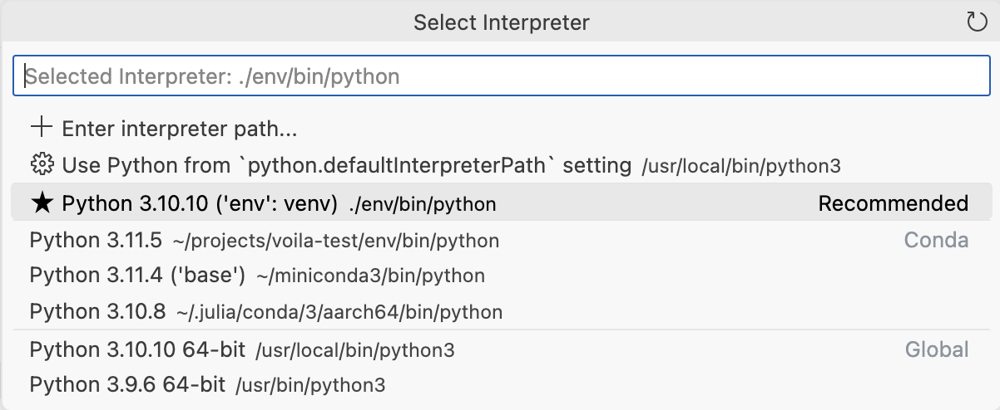

## Dashboard Documentation

To work on dashboard documentation:

1)  Open this folder (`/docs/dashboards/`) as a VS Code workspace.

2)  Then, create and activate the virtual environment:

    ``` bash
    ./configure.sh && source env/bin/activate
    ```

3)  Finally, set VS Code to use this environment:

    

