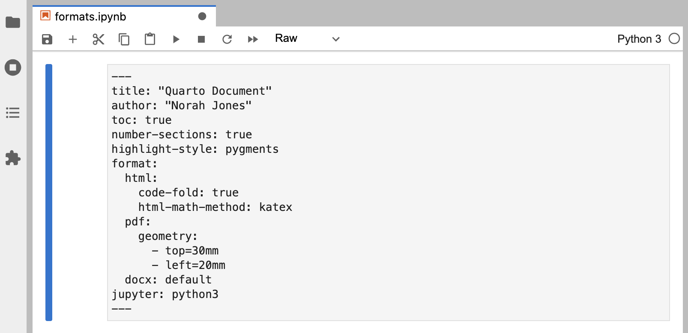

### Overview

In this tutorial we'll show you how to author Quarto documents in Jupyter Lab. In particular, we'll discuss the various document formats you can produce and show you how to add components like table of contents, equations, citations, cross-references, and more.

### Output Formats

Quarto supports rendering notebooks to dozens of different output formats. By default, the `html` format is used, but you can specify an alternate format (or formats) within document options.

#### Format Options

Let's create a notebook and add some formats and options to it. As a reminder, document options are specified in YAML within a "Raw" cell at the beginning of the notebook. To create a Raw cell, add a cell at the top of the notebook and set its type to Raw using the notebook toolbar:

{.border }

Now, let's add some basic document metadata and a default output format:

{.border }

We specified `pdf` as the default output format (if we exclude the `format` option then it will default to `html`).

Let's add some options to control our PDF output:

{.boder}

#### Multiple Formats

Some documents you create will have only a single output format, however in many cases it will be desirable to support multiple formats. Let's add the `html` and `docx` formats to our document:

{.border }

There's a lot to take in here! Let's break it down a bit. The first two lines are generic document metadata that aren't related to output formats at all:

``` yaml
title: "Quarto Document"
author: "Norah Jones"
```

The next three lines are document format options that *apply to all formats* (which is why they are specified at the root level):

``` yaml
toc: true
number-sections: true
highlight-style: pygments
```

Next, we have the `format` option, where we provide format-specific options:

``` yaml
format:
  html: 
    code-fold: true
    html-math-method: katex
  pdf:
    geometry: 
      - top=30mm
      - left=30mm
  docx: default
```

The `html` and `pdf` formats each provide an option or two (its not important at this point to understand what those options do, although you can probably guess from their names). The `docx` format is a bit different---it specifies `docx: default`. This means just use all of the default options for the format.

#### Rendering

The formats specified within document options define what is rendered by default. So for the options above, if we executed this:

``` bash
quarto render notebook.ipynb
```

Then the following files would be created:

-   notebook.html
-   notebook.pdf
-   notebook.docx

We can select one or more formats using the `--to` option:

``` bash
quarto render notebook.ipynb --to docx
quarto render notebook.ipynb --to docx,pdf
```

If needed we can also render formats that aren't specified within document options:

``` bash
quarto render notebook.ipynb --to odt
```

Since the `odt` format isn't included within document options, the default options for the format will be used.

### Sections

You can use a table of contents and/or section numbering to make it easier for readers to navigate your document. Do this by adding the `toc` and/or `number-sections` options to document options (note that these options are typically specified at the root level because they are shared across all formats):

{.border }

Here's what this document looks like when rendered to HTML:

{.border }

There are lots of options available for controlling how the table of contents and section numbering behave. See the output format documentation (e.g. [HTML](/docs/output-formats/html-basics.qmd), [PDF](/docs/output-formats/pdf-basics.qmd), [MS Word](/docs/output-formats/ms-word.qmd)) for additional details.

### Equations

You can add LaTeX equations to markdown cells within Jupyter Lab. For example:

{.border }

Equations are rendered when you run the cell:

{.border }

Inline equations are delimited with `$…$`. To create a display equation use `$$…$$`. See the documentation on [markdown equations](/docs/authoring/markdown-basics.html#equations) for additional details.

### Citations

To cite other works within a Quarto document. First create a bibliography file in a supported format (BibTeX or CSL). Then, link the bibliography to your document using the `bibliography` YAML metadata option.

Here's a notebook that includes a bibliography and single citation (markdown cells are un-executed so you can see all of the syntax):

{.border }

Note that items within the bibliography are cited using the `@citeid` syntax:

``` markdown
 Knuth says always be literate [@knuth1984]
```

References will be included at the end of the document, so we includ a `## References` heading at the bottom of the notebook.

Here is what this document looks like when rendered:

{.border  width="600"}

\
The `@` citation syntax is very flexible and includes support for prefixes, suffixes, locators, and in-text citations. See the documentation on [Citations and Footnotes](/docs/authoring/footnotes-and-citations.qmd) to learn more.

### Cross References

Cross-references make it easier for readers to navigate your document by providing numbered references and hyperlinks to figures, tables, equations, and sections. Cross-reference-able entities generally requires a label (unique identifier) and caption.

Here's a notebook that illustrates cross-referencing various types of entities (the markdown cells are again un-executed so that the syntax is visible):

{.border }

This example includes cross-referenced sections, figures, and equations. Here's how we expressed each of these:

+---------------+---------------+----------------------------------+
| Entity        | Reference     | Label / Caption                  |
+===============+===============+==================================+
| Section       | `@sec-plot`   | ID added to heading:             |
|               |               |                                  |
|               |               | ``` {.default code-copy="false"} |
|               |               | # Plot {#sec-plot}               |
|               |               | ```                              |
+---------------+---------------+----------------------------------+
| Figure        | `@fig-simple` | YAML options in code cell:       |
|               |               |                                  |
|               |               | ``` {.default code-copy="false"} |
|               |               | #| label: fig-simple             |
|               |               | #| fig-cap: Simple Plot          |
|               |               | ```                              |
+---------------+---------------+----------------------------------+
| Equation      | `@eq-stddev`  | At end of display equation:      |
|               |               |                                  |
|               |               | ``` default                      |
|               |               | $$ {#eq-stddev}                  |
|               |               | ```                              |
+---------------+---------------+----------------------------------+

: {tbl-colwidths=\[20,30,50\]}

Here's what this notebook looks like when rendered:

{.border  width="600"}

See the article on [Cross References](/docs/authoring/cross-references.qmd) to learn more, including how to customize caption and reference text (e.g. use "Fig." rather than "Figure").

### Callouts

Callouts are an excellent way to draw extra attention to certain concepts, or to more clearly indicate that certain content is supplemental or applicable to only some scenarios.

Callouts are markdown divs that have special callout attributes. Here's an example of creating a callout within a markdown cell:

{.border }

Note that if we run this cell you'll see that the output looks nothing like a callout! This is because callouts aren't supported natively by the markdown renderer built in to Jupyter Lab.

{.border }

However, when we ultimatley render the document with Quarto the callout appears as intended:

{.border }

You can learn more about the different types of callouts and options for their appearance in the [Callouts](/docs/authoring/callouts.qmd) documentation.

### Article Layout

The body of Quarto articles have a default width of approximately 700 pixels. This width is chosen to [optimize readability](https://medium.com/ben-shoemate/optimum-web-readability-max-and-min-width-for-page-text-dee9987a27a0). This normally leaves some available space in the document margins, and there are a few ways you can take advantage of this space.

In this notebook, we use the `reference-location` option to indicate that we'd like footnotes to be placed in the right margin.

We also use the `column: screen-inset` cell option to indicate we'd like our figure to occupy the full width of the screen (with a small inset).

{.border }

Here's what this document looks like when rendered:

{.border }

You can locate citations, footnotes, and asides in the margin. You can also define custom column spans for figures, tables, or other content. See the documentation on [Article Layout](/docs/authoring/article-layout.qmd) for additional details.
