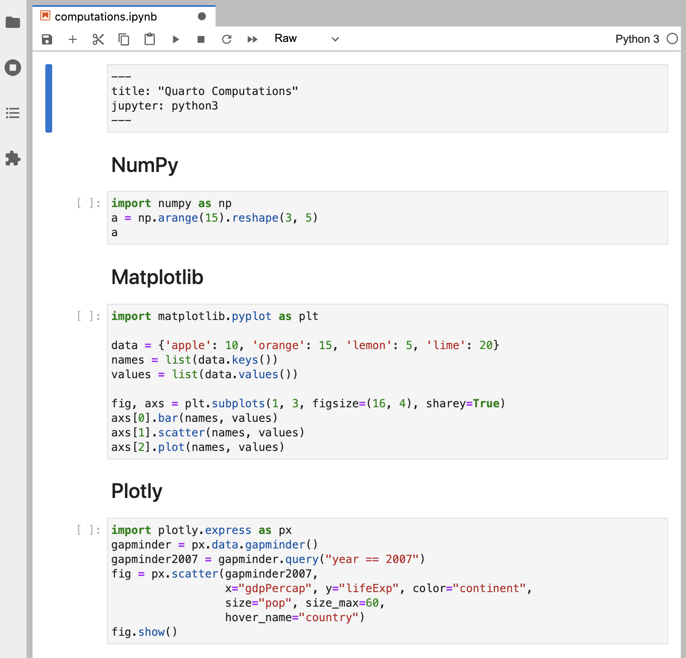

### Overview

Quarto has a wide variety of options available for controlling how code and computational output appear within rendered documents. In this tutorial we'll take a simple notebook that has some numeric output and plots and cover how to apply these options.

If you want to follow along step-by-step in your own environment, download this notebook:

::: {.callout-note appearance="minimal"}
<i class="bi bi-journal-code"></i> [Download computations.ipynb](_computations.ipynb){download="computations.ipynb"}
:::

Now, make sure you are in the directory containing `computations.ipynb`, then issue this command to open Jupyter Lab and start working with the notebook:

+-----------------+-----------------------------------------------+
| Platform        | Command                                       |
+=================+===============================================+
| Mac/Linux       |     python3 -m jupyter lab computations.ipynb |
+-----------------+-----------------------------------------------+
| Windows         |     py -m jupyter lab computations.ipynb      |
+-----------------+-----------------------------------------------+

Here's the notebook as we start out (note that none of the cells are executed yet):

{.border .column-body-outset-right}

Create a new Terminal within Jupyter Lab that you'll use for Quarto commands:

{.border .column-body-outset-right}

Finally, run `quarto preview` in the terminal and position Jupyter Lab side-by-side with the browser showing the preview:

``` bash
quarto preview computations.ipynb
```

{.border .column-page-right}

Note that none of the cells have been executed yet. Go ahead and run all of the cells and then save the notebook---the preview in the browser should update with all of the output.

### Cell Output

All of the code in the notebook is included within the document. However, for some documents you may want to hide all of the code and just show the output. Let's go ahead and speicfy `echo: false` within the document `execute` options to prevent code from printing:

{.border .column-body-outset-right}

Save the notebook after making this change. The preview will update to show the output with no code:

{.border}

You might want to selectively enable code `echo` for some cells. To do this add the `echo: true` cell option. Try this with the NumPy cell:

{.border .column-body-outset-right}

Save the notebook and note that the code is now included for the NumPy cell:

{.border .column-body-outset-right}

There are lots of other options available for cell output. See the [Jupyter Cell Options](https://quarto.org/docs/reference/cells/cells-jupyter.html) documentation for additional details.

### Code Folding

Rather than hiding code entirely, you might want fold it and provide users the choice. You can do this via the `code-fold` option. Remove the `echo` we previously added and add the `code-fold` HTML format option:

{.border .column-body-outset-right}

Save the notebook. Now a "Code" widget is available above the output of each cell:

{.border .column-body-outset-right}

You can also provide global control over code folding. Try adding `code-tools: true` to the HTML format options:

{.border .column-body-outset-right}

Save the notebook---a code menu appears at the top right of the document:

{.border .column-body-outset-right}

### Figures

Let's improve the appearance of our Matplotlib output. It could stand to be quite a bit wider and it would be nice to provide a caption as well as a label for cross-referencing.

Go ahead and Matplotlib cell to include `label` and `fig-cap` options as well as a call to `fig.set_size_inches()` to set a larger figure size with a wider aspect ratio:

{.border .column-body-outset-right}

Execute the cell to see the updated plot. Then, save the notebook to check out the Quarto preview:

{.border .column-body-outset-right}

### Multiple Figures

The Plotly cell visualizes GDP and life expectancy data from a single year (2007). Let's plot another year side-by-side for comparison and add some captions and subcaptions. Since this will produce a wider visualization we'll also use the `column` option to lay it out across the entire page (rather than being constrained to the body text column).

There are quite a few changes to the code---copy and paste the below into the notebook if you want to try these changes locally:

``` python
#| label: fig-gapminder
#| fig-cap: | 
#|   Life Expectancy and GDP 
#|   (Data from World Bank via gapminder.org)
#| fig-subcap:
#|   - "Gapminder: 1957"
#|   - "Gapminder: 2007"
#| layout-ncol: 2
#| column: page

import plotly.express as px
gapminder = px.data.gapminder()
def gapminder_plot(year):
    gapminderYear = gapminder.query("year == " + 
                                    str(year))
    fig = px.scatter(gapminderYear, 
                     x="gdpPercap", y="lifeExp",
                     size="pop", size_max=60,
                     hover_name="country")
    fig.show()
    
gapminder_plot(1957)
gapminder_plot(2007)
```

Run the updated cell then save the notebook. The preview will update as follows:

{.border .column-body-outset-right}

There are a few new options used in this example including `fig-cap`, `fig-subcap`, `layout-ncol`, and `column` See the articles on [Figure Layout](/docs/authoring/figure-layout.qmd) and [Article Layout](/docs/authoring/article-layout.qmd) for additional details on these and other option related to figures and layout.
