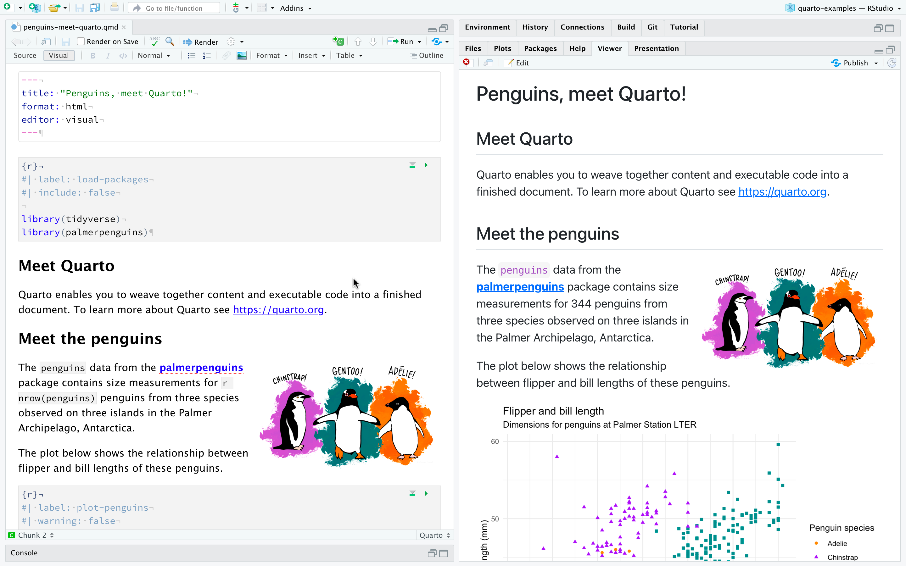
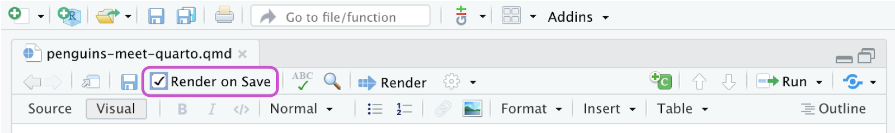
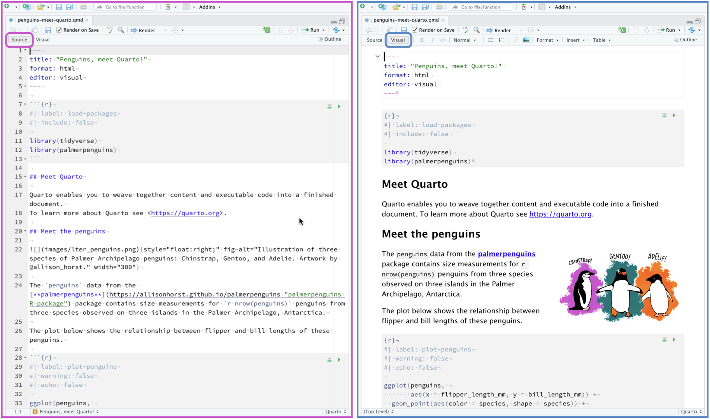
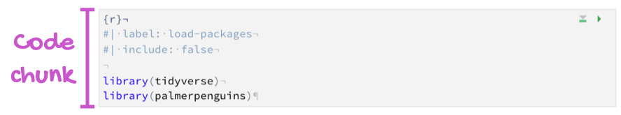
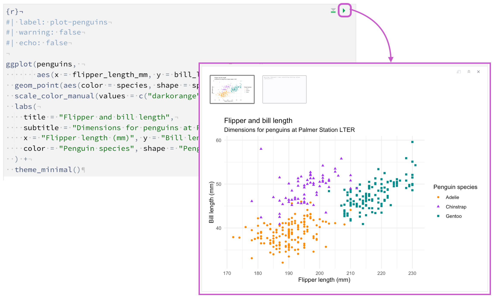
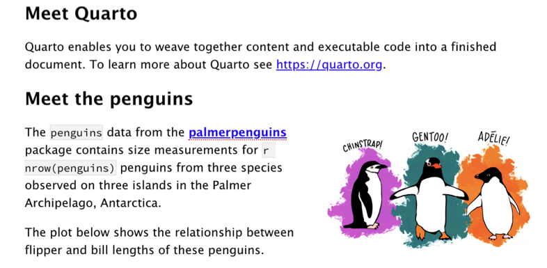

### Overview

In this tutorial we'll show you how to use RStudio with Quarto. You'll edit code and markdown in RStudio just as you would with any computational document (e.g., R Markdown), and preview the rendered document in the Viewer tab as you work.

The following is a Quarto document with the extension `.qmd` (on the left) along with its rendered version as HTML (on the right). You could also choose to render it into other formats like PDF, MS Word, etc.

{ fig-alt="RStudio IDE with a Quarto document titled \"Penguins, meet Quarto!\" open on the left side and the rendered version of the document on the right side."}

This is the basic model for Quarto publishing---take a source document (in this case a notebook), and render it to a variety of output formats. Want to give it a try? Download the following `.qmd` file, open it in RStudio, and click on <kbd>{width="25" height="20"}</kbd> Render.

::: {.callout-note appearance="minimal"}
<i class="bi bi-journal-code"></i> [Download penguins-meet-quarto.qmd](_penguins-meet-quarto.qmd){download="penguins-meet-quarto.qmd"}
:::

### Rendering

Use the <kbd>{width="25" height="20"}</kbd> Render button in the RStudio IDE to render the file and preview the output with a single click or keyboard shortcut (⇧⌘K).

{fig-alt="Top of the text editor in the RStudio IDE with the Render button highlighted with a purple box."}

If you prefer to automatically render whenever you save, you can check the Render on Save option on the editor toolbar. The preview will update whenever you re-render the document. Side-by-side preview works for both HTML and PDF outputs.

{fig-alt="Top of the text editor in the RStudio IDE with the Render on Save checbox checked and highlighted with a purple box."}

When rendering, Quarto generates a new file that contains selected text, code, and results from the .qmd file. The new file can be an [HTML](https://quarto.org/docs/output-formats/all-formats.html), [PDF](https://quarto.org/docs/output-formats/pdf-basics.html), [MS Word](https://quarto.org/docs/output-formats/ms-word.html) document, [presentation](https://quarto.org/docs/presentations/), [website](https://quarto.org/docs/websites/), [book](https://quarto.org/docs/books/), [interactive document](https://quarto.org/docs/interactive/), or [other format](https://quarto.org/docs/output-formats/all-formats.html).

You can also render the document using the functions from the [**quarto**](https://github.com/quarto-dev/quarto-r) package, which provides an R interface to the Quarto CLI. For example, to render the current document, use `quarto::quarto_render()`. You can also specify the name of the document you want to render as well as the output format, e.g., `quarto::quarto_render("penguins-meet-quarto.qmd", output_format = "pdf")`.

### Authoring

In the earlier image, the source code (on the left) looks very similar to the rendered output (on the right) since we are viewing the file in the [visual editor](https://rstudio.github.io/visual-markdown-editing/). Switching to the source editor reveals the plain text source code underlying the document.

{ fig-alt="On the left: Document in the source editor. On the right: Same document in the visual editor. The document shown is the \"Penguins, meet Quarto!\" document from a previous image on the page."}

The file contains three types of content.

#### YAML header

An (optional) YAML header emarcated by three dashes (`---`) on either end:

{fig-alt="YAML of the of the linked example document titled \"Penguins, meet Quarto!\", with annotation that reads \"YAML\"." width="700"}

When rendered, the `title` , `"Penguins, meet Quarto!"`, will appear at the top of the rendered document with a larger font size than the rest of the document. The other two YAML fields in denote that the output should be in `html` `format` and the document should open in the `visual` `editor`, by default.

The basic syntax of YAML uses key-value pairs in the format `key: value`. Other YAML fields commonly found in headers of documents include metadata like `author`, `subtitle`, `date` as well as customization options like `theme`, `fontcolor`, `fig-width`, etc. You can find out about all available YAML fields for HTML documents [here](/docs/reference/formats/html.html). The available YAML fields vary based on document format, e.g., see [here](/docs/reference/formats/pdf.html) for YAML fields for PDF documents and [here](/docs/reference/formats/docx.html) for MS Word.

#### Code chunks

R code chunks identified with `{r}` with (optional) chunk options, in YAML style, identified by `#|` at the beginning of the line:

{fig-alt="The first code chunk of the of the linked example document titled \"Penguins, meet Quarto!\", with annotation that reads \"Code chunk\"." width="700"}

In this case the `label` of the code chunk is `load-packages` and we set `include` to `false` to indicate that we don't want the chunk itself or any of its outputs in the rendered documents.

In addition to rendering the complete document to view the results of code chunks you can also run each code chunk interactively in the RStudio editor by clicking the  icon. RStudio executes the code and displays the results either inline within your file or in the Console, depending on your preference.

{fig-alt="Run a code chunk and display output inline" fig-align="center"}

#### Markdown text

Text with formatting, including section headers, hyperlinks, an embedded image, and an inline code chunk:

{fig-alt="Text portion of the of the linked example document titled \"Penguins, meet Quarto!\", with annotation that reads \"Text\"." width="700"}

Quarto uses markdown syntax for text. If using the visual editor you won't need to learn much markdown syntax for authoring your document as you can use the menus and shortcuts to add a header, bold text, insert a table, etc. If using the source editor, you can achieve these with markdown expressions like `##`, `**bold**`, etc.

### How it works

When you render a Quarto document, first [knitr](http://yihui.name/knitr/) executes all of the code chunks and creates a new markdown (.md) document which includes the code and its output. This markdown file generated is then processed by [pandoc](http://pandoc.org/), which creates the finished format. The Render button encapsulates these actions and executes them in the right order for you.

::: callout-important
TO DO: Update this for Quarto
:::

\
