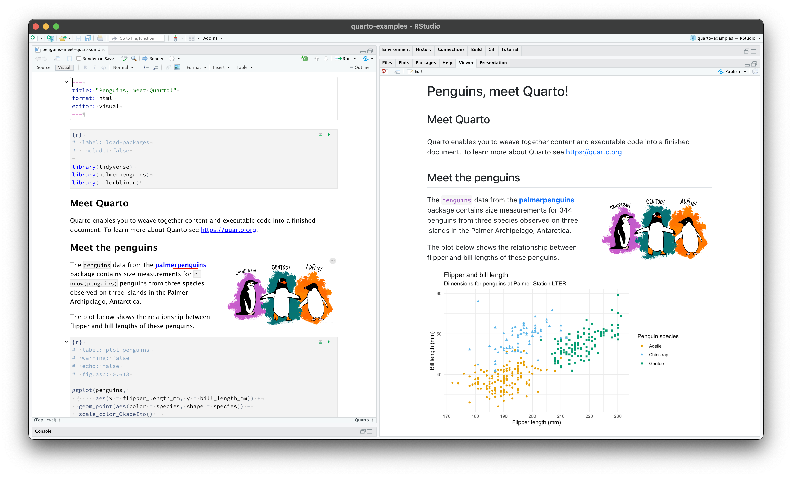
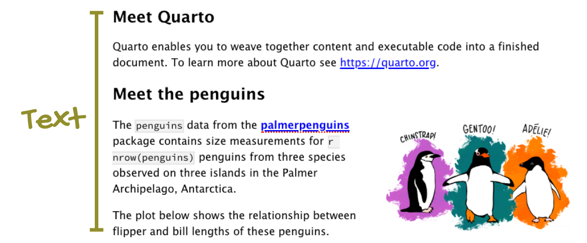
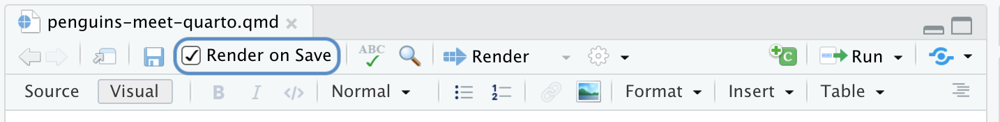

This is a Quarto file with the extension `.qmd`. You can open it [here](https://rstudio.cloud/project/3519977) on RStudio Cloud.

{.column-page-right fig-alt="RStudio IDE with a Quarto document titled \"Hello Quarto!\" open on the left side and a blank viewer pane on the right side."}

The source code (on the left) looks very similar to the rendered output (on the right) since we are viewing the file in the [visual editor](https://rstudio.github.io/visual-markdown-editing/). Switching to the source editor reveals the plain text source code underlying the document.

{.column-page-right fig-alt="On the left: Document in the visual editor. On the right: Same document in the source editor."}

Notice that the file contains three types of content:

-   An (optional) YAML header surrounded by fences comprised of three dashes (`---`):

{.column-body-outset-right fig-alt="YAML of the of the linked example document titled \"Penguins, meet Quarto!\", with annotation that reads \"YAML\"."}

-   R code chunks identified with `{r}` with (optional) chunk options, in YAML style, identified by `#|` at the beginning of the line:

{.column-body-outset-right fig-alt="The first code chunk of the of the linked example document titled \"Penguins, meet Quarto!\", with annotation that reads \"Code chunk\"."}

-   Text with formatting, including section headers, hyperlinks, an embedded image, and an inline code chunk:

{.column-body-outset-right fig-alt="Text portion of the of the linked example document titled \"Penguins, meet Quarto!\", with annotation that reads \"Text\"."}

### Rendering output

Use the {width="60"} (**Render**) button in the RStudio IDE to render the file and preview the output with a single click or keyboard shortcut (⇧⌘K).

If you prefer to automatically render whenever you save you can check the **Render on Save** option on the editor toolbar. The preview will update whenever you re-render the document. Side-by-side preview works for both HTML and PDF outputs.

{.column-body-outset-right fig-alt="Top of the editor in the RStudio IDE with \"Render on Save\" checked"}

When rendering, Quarto generates a new file that contains selected text, code, and results from the .qmd file. The new file can be an [HTML](https://quarto.org/docs/output-formats/all-formats.html), [PDF](https://quarto.org/docs/output-formats/pdf-basics.html), [MS Word](https://quarto.org/docs/output-formats/ms-word.html) document, [presentation](https://quarto.org/docs/presentations/), [website](https://quarto.org/docs/websites/), [book](https://quarto.org/docs/books/), [interactive document](https://quarto.org/docs/interactive/), or [other format](https://quarto.org/docs/output-formats/all-formats.html).

You can also render the document using the functions from the [**quarto**](https://github.com/quarto-dev/quarto-r) package, which provides an R interface to the Quarto CLI:

```{r}
#| eval: false

quarto::quarto_render()
```

### Notebook interface

When you open the file in the RStudio IDE, it becomes a notebook interface for R. You can run each code chunk by clicking the  icon. RStudio executes the code and displays the results either inline within your file or in the Console.

{.column-body-outset-right fig-alt="Run a code chunk and display output inline" fig-align="center"}

### How it works

When you render a Quarto document, first [knitr](http://yihui.name/knitr/) executes all of the code chunks and creates a new markdown (.md) document which includes the code and its output. This markdown file generated is then processed by [pandoc](http://pandoc.org/), which creates the finished format. The Render button encapsulates these actions and executes them in the right order for you.\
\
