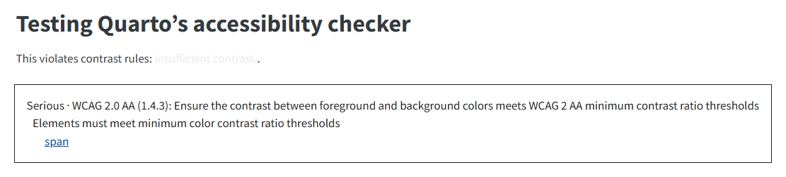

::: callout-note
This feature was introduced in Quarto 1.8.
:::

Quarto includes integrated support for [`axe-core`](https://github.com/dequelabs/axe-core), a broadly-supported, open source, industry standard tool for accessibility checks in HTML documents.

## Accessibility checks with `axe-core`

To enable the simplest form of accessibility checks in Quarto 1.8, add the `axe` YAML metadata configuration to HTML `format`s (`html`, `dashboard`, and `revealjs`):

``` yaml
format:
  html:
    axe: true
```

In this situation, if your webpage has accessibility violations that `axe-core` can catch, Quarto will produce console messages that are visible by opening your browser's development tools.

### Customization

Quarto supports two additional output formats for the accessibility checks, available through the `output` option.

-   `document`: embedded reports

    ``` yaml
    format:
      html:
        axe:
          output: document 
    ```

    With this option, Quarto will generate a visible report of `axe-core` violations on the webpage itself. Each violation displays its WCAG conformance level (e.g., `WCAG 2.0 AA`), so best-practice findings are distinguishable from genuine WCAG failures. This is useful for visual inspection of a page. Note that with this setting, Quarto will always produce a report.

    If you wish to use this feature, we recommend adding it to a "debug" [project profile](/docs/projects/profiles.qmd) to reduce the chance you will accidentally publish a website to production with these reports.

-   `json`: JSON-formatted console output

    ``` yaml
    format:
      html:
        axe:
          output: json
    ```

    This option is useful if you're comfortable with browser automation tools such as [Puppeteer](https://pptr.dev/) and [Playwright](https://playwright.dev/), since it produces output to the console in a format that can be easily consumed.

    Specifically, the JSON object produced is the result of running `axe-core`'s `run` method on the webpage. We defer to `axe-core`'s [documentation for full information on that object](https://github.com/dequelabs/axe-core).

-   `console`

    ``` yaml
    format:
      html:
        axe:
          output: console
    ```

    This option is equivalent to `axe: true`.

### Checking against a WCAG conformance level

::: callout-note
The `standard` and `best-practice` options were introduced in Quarto 1.10.
:::

By default, `axe-core` runs its full default rule set, which combines rules for several WCAG versions and levels with axe's own "best practice" rules. If you are working toward a specific WCAG conformance level, use the `standard` option to check only the rules for that level:

``` yaml
format:
  html:
    axe:
      output: document
      standard: wcag21aa
```

The available values name a WCAG version followed by a level: `wcag2a`, `wcag2aa`, `wcag2aaa`, `wcag21a`, `wcag21aa`, `wcag21aaa`, `wcag22a`, `wcag22aa`, and `wcag22aaa`. Each standard is cumulative — it includes the rules for the lower levels and earlier versions it builds on. For example, `standard: wcag21aa` checks the rules for WCAG 2.0 A, 2.0 AA, 2.1 A, and 2.1 AA.

For the full list of rules, grouped by these same WCAG versions and levels, see `axe-core`'s [rule descriptions](https://github.com/dequelabs/axe-core/blob/develop/doc/rule-descriptions.md); each rule links to a page describing what it checks, why it matters, and how to fix violations.

Setting `standard` has two effects beyond filtering the checks to the chosen level:

-   Choosing a standard can surface violations the default checks don't report, because `axe-core` keeps a few rules off by default and Quarto enables them when your standard requires them. For example, `standard: wcag2aaa` checks text contrast against the stricter AAA ratio rather than the AA ratio, and `standard: wcag22aa` checks that interactive elements like buttons and links are large enough to tap — a requirement introduced in WCAG 2.2. Rules that `axe-core` has deprecated are never added, whichever standard you choose.

-   Axe's best-practice rules — recommendations that aren't required by any WCAG success criterion — are excluded. To check them alongside a standard, add `best-practice: true`:

    ``` yaml
    format:
      html:
        axe:
          output: document
          standard: wcag21aa
          best-practice: true
    ```

You can also exclude the best-practice rules without choosing a standard by setting `best-practice: false` on its own; the WCAG rules from the default rule set still run.

## Example: insufficient contrast

As a minimal example of how this works in Quarto, consider this simple document:

::: light-content

``` markdown
---
title: Testing Quarto's accessibility checker
format:
  html: 
    axe:
      output: document
---

This violates contrast rules: [insufficient contrast.]{style="color: #eee"}.
```

:::

::: dark-content

``` markdown
---
title: Testing Quarto's accessibility checker
format:
  html: 
    axe:
      output: document
---

This violates contrast rules: [insufficient contrast.]{style="color: #111"}.
```

::: 


This is the produced result visible on the page:

::: {.light-content}
{fig-alt="A rendered webpage with an overlay in the bottom right corner reporting a color contrast violation found by axe-core, including the selector of the offending element."}
:::

::: {.dark-content}
{.autodark fig-alt="A rendered webpage with an overlay in the bottom right corner reporting a color contrast violation found by axe-core, including the selector of the offending element."}
:::

## Planned work: automated checks before publishing

Currently, this feature requires users to open the webpage in a [local preview](/docs/websites/index.html#website-preview). (Before Quarto 1.10, the `axe-core` library was loaded from a CDN; it is now bundled with Quarto, so checks also work offline.)

In the future, we envision a mode where every page of a website can be checked at the time of `quarto render` or `quarto publish` in order to reduce the amount of required manual intervention.