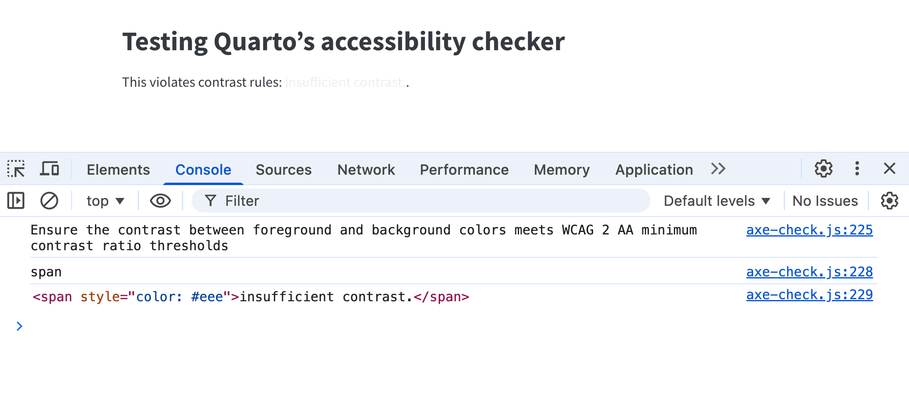
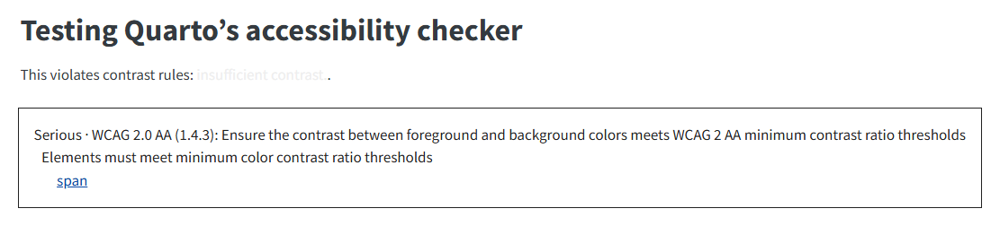



Quarto includes integrated support for [`axe-core`](https://github.com/dequelabs/axe-core), a broadly-supported, open source, industry standard tool for accessibility checks in HTML documents.

## Interactive accessibility checks

To enable the simplest form of accessibility checks, add the `axe` YAML metadata configuration to HTML `format`s (`html`, `dashboard`, and `revealjs`):

``` yaml
format:
  html:
    axe: true
```

Render and open the document in a browser. Accessibility violations will be visible as console messages in your browser's development tools. 

For example, this document contains a color contrast violation:

::: light-content

``` markdown
---
title: Testing Quarto's accessibility checker
format:
  html:
    axe: true
---

This violates contrast rules: [insufficient contrast.]{style="color: #eee"}.
```

:::

::: dark-content

``` markdown
---
title: Testing Quarto's accessibility checker
format:
  html:
    axe: true
---

This violates contrast rules: [insufficient contrast.]{style="color: #111"}.
```

:::

Previewing the rendered page and opening the browser's developer tools shows the violation `axe-core` found:

::: {.light-content}
{fig-alt="A rendered webpage with the browser developer tools open below it. The console shows messages from axe-core: a violation description reading 'Ensure the contrast between foreground and background colors meets WCAG 2 AA minimum contrast ratio thresholds', followed by the selector and HTML of the offending element."}
:::

::: {.dark-content}
{.autodark fig-alt="A rendered webpage with the browser developer tools open below it. The console shows messages from axe-core: a violation description reading 'Ensure the contrast between foreground and background colors meets WCAG 2 AA minimum contrast ratio thresholds', followed by the selector and HTML of the offending element."}
:::

### Output location

Quarto supports three output formats for the accessibility checks, available through the `output` option.

-   `document`: embedded reports

    ``` yaml
    format:
      html:
        axe:
          output: document
    ```

    With this option, Quarto will generate a visible report of `axe-core` violations on the webpage itself. Each violation displays its WCAG conformance level (e.g., `WCAG 2.0 AA`), so best-practice findings are distinguishable from genuine WCAG failures. This is useful for visual inspection of a page. Note that with this setting, Quarto will always produce a report.

    If you wish to use this feature, we recommend adding it to a "debug" [project profile](/docs/projects/profiles.qmd) to reduce the chance you will accidentally publish a website to production with these reports.

-   `json`: JSON-formatted console output

    ``` yaml
    format:
      html:
        axe:
          output: json
    ```

    This option is useful if you're comfortable with browser automation tools such as [Puppeteer](https://pptr.dev/) and [Playwright](https://playwright.dev/), since it produces output to the console in a format that can be easily consumed.

    Specifically, the JSON object produced is the result of running `axe-core`'s `run` method on the webpage. We defer to `axe-core`'s [documentation for full information on that object](https://github.com/dequelabs/axe-core).

-   `console`

    ``` yaml
    format:
      html:
        axe:
          output: console
    ```

    This option is equivalent to `axe: true`.

For the example above, `output: document` places the report on the page itself:

::: {.light-content}
{.border fig-alt="A rendered webpage with an overlay along the bottom reporting a color contrast violation found by axe-core, including its severity, WCAG conformance level, and the selector of the offending element."}
:::

::: {.dark-content}
{.border .autodark fig-alt="A rendered webpage with an overlay along the bottom reporting a color contrast violation found by axe-core, including its severity, WCAG conformance level, and the selector of the offending element."}
:::

### Checking against a WCAG conformance level



By default, `axe-core` runs its full default rule set, which combines rules for several WCAG versions and levels with axe's own "best practice" rules. If you are working toward a specific WCAG conformance level, use the `standard` option to check only the rules for that level:

``` yaml
format:
  html:
    axe:
      standard: wcag21aa
```

The available values name a WCAG version followed by a level: `wcag2a`, `wcag2aa`, `wcag2aaa`, `wcag21a`, `wcag21aa`, `wcag21aaa`, `wcag22a`, `wcag22aa`, and `wcag22aaa`. Each standard is cumulative — it includes the rules for the lower levels and earlier versions it builds on. For example, `standard: wcag21aa` checks the rules for WCAG 2.0 A, 2.0 AA, 2.1 A, and 2.1 AA.

For the full list of rules, grouped by these same WCAG versions and levels, see `axe-core`'s [rule descriptions](https://github.com/dequelabs/axe-core/blob/develop/doc/rule-descriptions.md).

When you specify `standard` Axe's best-practice rules are excluded. To check them alongside a standard, add `best-practice: true`:

``` yaml
format:
  html:
    axe:
      standard: wcag21aa
      best-practice: true
```

You can also exclude the best-practice rules without choosing a standard by setting `best-practice: false` on its own.

## Site-wide accessibility checks

The checks above are interactive: they require opening each page in a [local preview](/docs/websites/index.html#website-preview) and inspecting the results in the browser.

In the future, we envision a mode where every page of a website can be checked at the time of `quarto render` or `quarto publish` in order to reduce the amount of required manual intervention.
