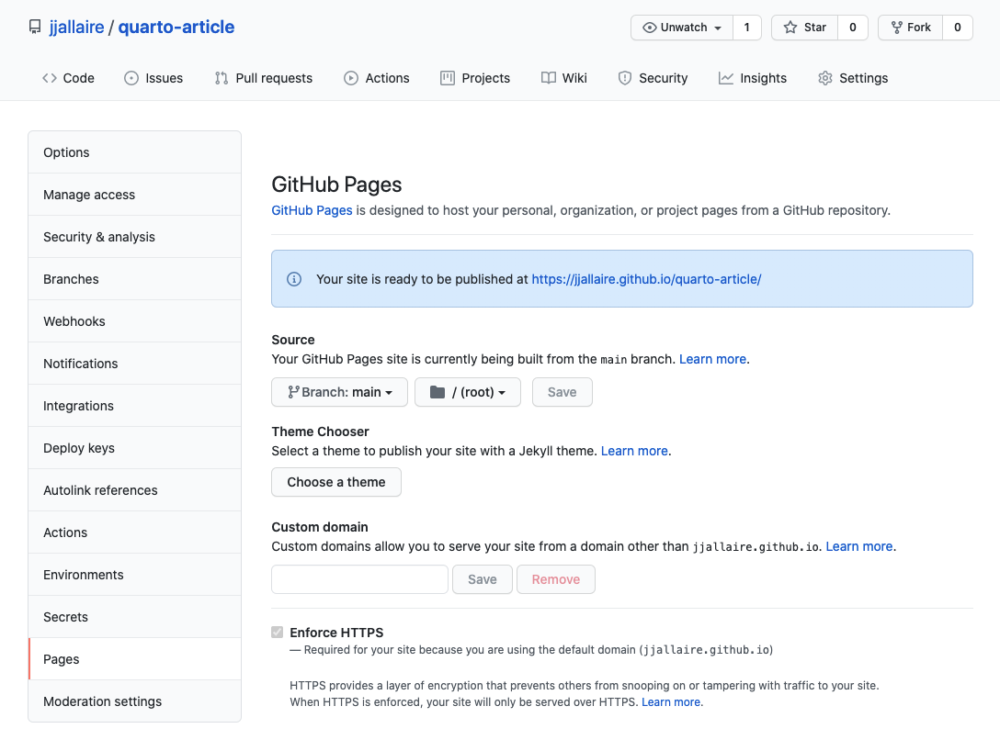

This article covers the various ways you can publish Quarto HTML documents, including:

-   Using [GitHub Pages] to host your article on GitHub

-   Sharing a standalone HTML file using E-mail, Dropbox, etc.

-   Publishing to [RStudio Connect].

Note that it's also possible to publish collections of Quarto documents as a website (see the article on [publishing websites](../websites/publishing-websites.md) for additional details).

## GitHub Pages

[GitHub Pages](https://pages.github.com/) is a service that lets you publish a website from any GitHub repository. While the service supports publishing full websites, it's also a perfectly suitable place to publish a single Quarto document.

Here are the steps required to publish a Distill article to GitHub Pages:

1)  Create a new Git repository that will be used to host your article.

2)  Configure your repository to publish the contents of the `main` or `master` branch (you can do this from the *Pages* section of your repository settings:

    {.border}

    Note that the **Source** is set to the root directory of the `main` branch.

3)  Create a Quarto document named `index.qmd` within the repository (using this name will allow your article to be served as the default web page for the repository).

4)  Write and render your article using Quarto.

5)  Push the article (including the HTML file generated when you rendered it) to GitHub. Your article is now published!

GitHub Pages are served on the `github.io` domain (with your GitHub account as a sub-domain). For example, if your GitHub username is `jsmith` and your repository is named `quarto-article` then the article will be available at <https://jsmith.github.io/quarto-article>.

## Standalone HTML

You can optionally render Quarto documents into `self-contained` HTML, whereby all of the content required to render the article (images generated by plots, required CSS and JavaScript, etc.) are bundled into a single HTML file. Use the `self-contained` option to do this:

``` {.yaml}
format:
   html:
     self-contained: true
```

Then, you can share this HTML file using the same means you use to share other document types like spreadsheets, presentations, and PDFs (e.g by uploading it to Dropbox or any other file sharing service).

This type of sharing is suitable for private communications to small groups. If you want to make your article available more broadly the following sections cover various ways to do that.

## RStudio Connect

[RStudio Connect](https://www.rstudio.com/products/connect/) is a server product from RStudio for secure sharing of websites, applications, reports, and plots.

You can deploy a Quarto HTML document to RStudio Connect from the command line using the `quarto_publish_doc()` function from the R quarto package. For example:

``` {.r}
library(quarto)
quarto_publish_doc("document.qmd", server = "https://rsc.example.com")
```

Note that once you've published your site for the first time you can omit the `server` argument:

``` {.r}
quarto_publish_site("document.qmd")
```

## Other Services

Note that any web server or web host capable of hosting a static website can equally well host a single Quarto HTML document. See the article on publishing websites for details on publishing articles on a variety of other services including [Netlify](../websites/publishing-websites.md#netlify), [Firebase](../websites/publishing-websites.md#firebase), [Site44](../websites/publishing-websites.md#site44), and [Amazon S3](../websites/publishing-websites.md#amazon-s3).
