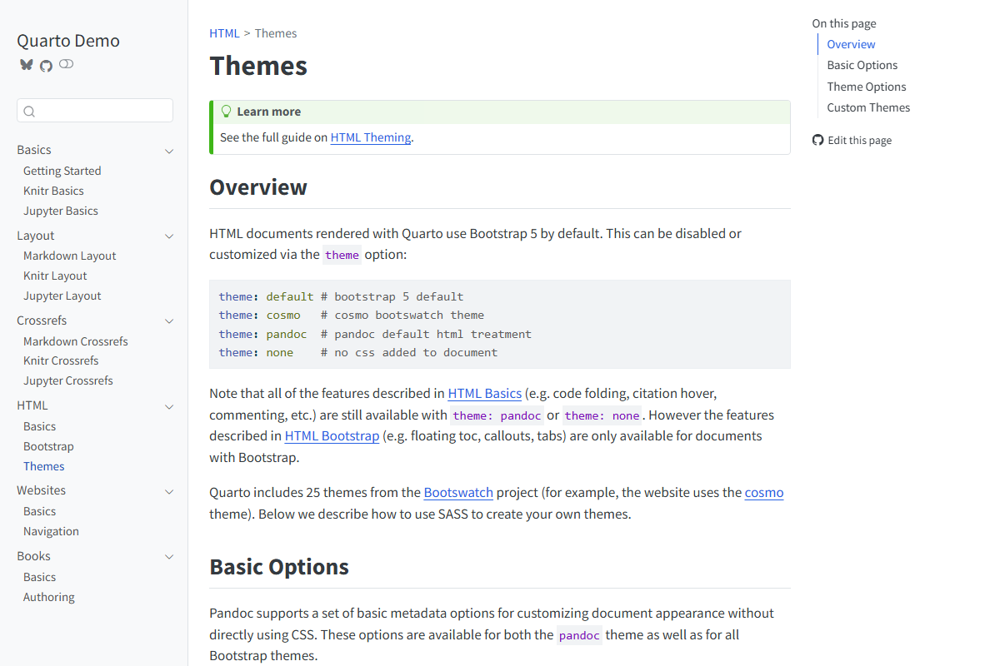
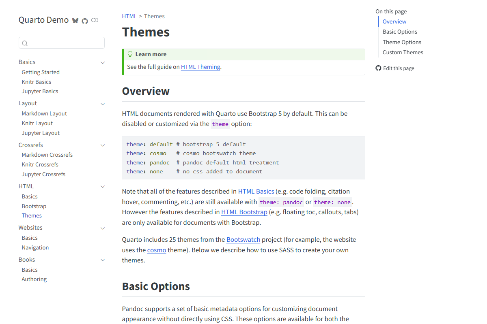
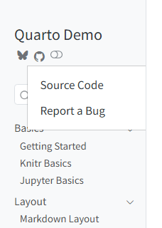
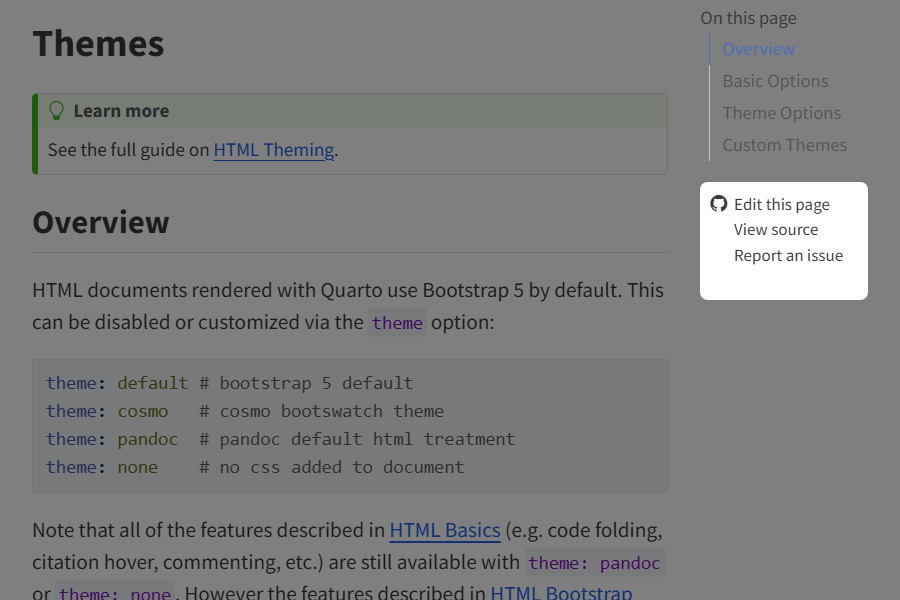

## Overview

There are a variety of options available for providing website navigation, including:

-   Using top navigation (a navbar) with optional sub-menus.

-   Using side navigation with a hierarchy of pages.

-   Combining top and side navigation (where top navigation links to different sections of the site each with their own side navigation).

In addition, you can add full text search to either the top or side navigation interface.

## Top Navigation

To add top-navigation to a website, add a `navbar` entry to the `site` config in `_quarto.yml`. For example, the following YAML:

``` {.yaml}
site:
  navbar:
    type: dark
    background: primary
    search: true
    left:
      - text: "Home"
        file: index.Rmd
      - talks.Rmd
      - about.Rmd 
```

Would result in a navigation bar that looks something like this:


Above we use the `left` option to specify items for the left side of the navigation bar. You can also use the `right` option to specify items for the right side.

The text for navigation bar items will be taken from the underlying target document's title. Note that in the above example we provide a custom `text: "Home"` value for `index.Rmd`.

You can also create a navigation menu by including a `menu` (which is list of items much like `left` and `right)`. For example:

``` {.yaml}
left:
  - text: "More"
    menu:
      - talks.Rmd
      - about.Rmd 
```

Here are all of the options available for top navigation:

+----------------+------------------------------------------------------------------------------------------------------------------------------------------------------------------------------------------------+
| Option         | Description                                                                                                                                                                                    |
+================+================================================================================================================================================================================================+
| title          | Navbar title (uses the `site-title` if none is specified).                                                                                                                                     |
+----------------+------------------------------------------------------------------------------------------------------------------------------------------------------------------------------------------------+
| logo           | Optional logo image to be displayed left of the title.                                                                                                                                         |
+----------------+------------------------------------------------------------------------------------------------------------------------------------------------------------------------------------------------+
| type           | "dark" or "light" (each Bootstrap theme has a light and dark variation of the navigation bar)                                                                                                  |
+----------------+------------------------------------------------------------------------------------------------------------------------------------------------------------------------------------------------+
| background     | Background color ("primary", "secondary", "success", "danger", "warning", "info", "light", or "dark")                                                                                          |
+----------------+------------------------------------------------------------------------------------------------------------------------------------------------------------------------------------------------+
| search         | Include a search box (true or false)                                                                                                                                                           |
+----------------+------------------------------------------------------------------------------------------------------------------------------------------------------------------------------------------------+
| left / right   | Lists of navigation items for left and right side of navbar                                                                                                                                    |
+----------------+------------------------------------------------------------------------------------------------------------------------------------------------------------------------------------------------+
| pinned         | Always show the navbar (true or false). Defaults to false, and uses [headroom.js](https://wicky.nillia.ms/headroom.js/) to automatically show the navbar when the user scrolls up on the page. |
+----------------+------------------------------------------------------------------------------------------------------------------------------------------------------------------------------------------------+
| collapse       | Collapse the navbar items into a hamburger menu when the display gets narrow (defaults to true)                                                                                                |
+----------------+------------------------------------------------------------------------------------------------------------------------------------------------------------------------------------------------+
| collapse-below | Responsive breakpoint at which to collapse navbar items to a hamburger menu ("sm", "md", "lg", "xl", or "xxl", defaults to "lg")                                                               |
+----------------+------------------------------------------------------------------------------------------------------------------------------------------------------------------------------------------------+

Here are the options available for individual navigation items:

+------------+-------------------------------------------------------------------------------------------------------------------------------------------------------------+
| Option     | Description                                                                                                                                                 |
+============+=============================================================================================================================================================+
| file       | Link to file contained with the project.                                                                                                                    |
+------------+-------------------------------------------------------------------------------------------------------------------------------------------------------------+
| url        | Link to external URL.                                                                                                                                       |
+------------+-------------------------------------------------------------------------------------------------------------------------------------------------------------+
| text       | Text to display for navigation item (defaults to the document `title` if not provided).                                                                     |
+------------+-------------------------------------------------------------------------------------------------------------------------------------------------------------+
| icon       | Name of one of the standard [Bootstrap 5 icons](https://icons.getbootstrap.com/) (e.g. "github", "twitter", "share", etc.).                                 |
+------------+-------------------------------------------------------------------------------------------------------------------------------------------------------------+
| aria-label | [Accessible label](https://developer.mozilla.org/en-US/docs/Web/Accessibility/ARIA/ARIA_Techniques/Using_the_aria-label_attribute) for the navigation item. |
+------------+-------------------------------------------------------------------------------------------------------------------------------------------------------------+
| menu       | List of navigation items to populate a drop-down menu.                                                                                                      |
+------------+-------------------------------------------------------------------------------------------------------------------------------------------------------------+

## Side Navigation {#side-navigation}

If your site consists of more than a handful of documents, you might prefer to use side navigation, which enables you to display an arbitrarily deep hierarchy or articles.

If you are reading this page on a desktop device then you will see the default side navigation display on the left (otherwise you'll see a title bar at the top which you can click or touch to reveal the navigation).

To add side navigation to a website, add a `sidebar` entry to the `site` section of `_quarto.yml`. For example:

``` {.yaml}
site:
  sidebar:
    style: "docked"
    search: true
    contents:
      - section: "Basics"
        contents:
          - index.md
          - basics-knitr.Rmd
          - basics-jupyter.md
      - section: "Layout"
        contents:
          - layout.md
          - layout-knitr.Rmd
          - layout-jupyter.md
```

There are two styles of side navigation available: "docked" which shows the navigation in a sidebar with a distinct background color, and "floating" which places it closer to the main body text. Here's that the "docked" and "floating" styles look like (respectively):

|                                   |                                   |
|:---------------------------------:|:---------------------------------:|
|  |  |

Here are all of the options available for side navigation:

+----------------+--------------------------------------------------------------------------------------------------------------------------------------------------------------------------------------------------------------------------------------------------------------------+
| Option         | Description                                                                                                                                                                                                                                                        |
+================+====================================================================================================================================================================================================================================================================+
| id             | Optional identifier (used only for hybrid navigation, described below).                                                                                                                                                                                            |
+----------------+--------------------------------------------------------------------------------------------------------------------------------------------------------------------------------------------------------------------------------------------------------------------+
| title          | Sidebar title (uses the project title if none is specified).                                                                                                                                                                                                       |
+----------------+--------------------------------------------------------------------------------------------------------------------------------------------------------------------------------------------------------------------------------------------------------------------+
| subtitle       | Optional subtitle                                                                                                                                                                                                                                                  |
+----------------+--------------------------------------------------------------------------------------------------------------------------------------------------------------------------------------------------------------------------------------------------------------------+
| logo           | Optional logo image                                                                                                                                                                                                                                                |
+----------------+--------------------------------------------------------------------------------------------------------------------------------------------------------------------------------------------------------------------------------------------------------------------+
| search         | Include a search box (true or false). Note that if there is already a search box on the top navigation bar it won't be displayed on the sidebar.                                                                                                                   |
+----------------+--------------------------------------------------------------------------------------------------------------------------------------------------------------------------------------------------------------------------------------------------------------------+
| tools          | List of sidebar tools (e.g. link to github or twitter, etc.). See the next section for details.                                                                                                                                                                    |
+----------------+--------------------------------------------------------------------------------------------------------------------------------------------------------------------------------------------------------------------------------------------------------------------+
| footer         | Footer content to place immediately below the sidebar.                                                                                                                                                                                                             |
+----------------+--------------------------------------------------------------------------------------------------------------------------------------------------------------------------------------------------------------------------------------------------------------------+
| items          | List of navigation items to display (typically top level items will in turn have a list of sub-items).                                                                                                                                                             |
+----------------+--------------------------------------------------------------------------------------------------------------------------------------------------------------------------------------------------------------------------------------------------------------------+
| style          | "docked" or "floating"                                                                                                                                                                                                                                             |
+----------------+--------------------------------------------------------------------------------------------------------------------------------------------------------------------------------------------------------------------------------------------------------------------+
| type           | "dark" or "light" (hint to make sure the text color is the inverse of the background)                                                                                                                                                                              |
+----------------+--------------------------------------------------------------------------------------------------------------------------------------------------------------------------------------------------------------------------------------------------------------------+
| background     | Background color ("none", "primary", "secondary", "success", "danger", "warning", "info", "light", "dark", or "white"). Defaults to "light".                                                                                                                       |
+----------------+--------------------------------------------------------------------------------------------------------------------------------------------------------------------------------------------------------------------------------------------------------------------+
| alignment      | Alignment ("left", "right", or "center").                                                                                                                                                                                                                          |
+----------------+--------------------------------------------------------------------------------------------------------------------------------------------------------------------------------------------------------------------------------------------------------------------+
| collapse-level | Whether to show sidebar navigation collapsed by default. The default is 2, which shows the top and next level fully expanded (but leaves the 3rd and subsequent levels collapsed).                                                                                 |
+----------------+--------------------------------------------------------------------------------------------------------------------------------------------------------------------------------------------------------------------------------------------------------------------+
| pinned         | Always show a title bar that expands to show the sidebar at narrower screen widths (true or false). Defaults to false, and uses [headroom.js](https://wicky.nillia.ms/headroom.js/) to automatically show the navigation bar when the user scrolls up on the page. |
+----------------+--------------------------------------------------------------------------------------------------------------------------------------------------------------------------------------------------------------------------------------------------------------------+

### Sidebar Tools {.unlisted}

In addition to traditional navigation, the sidebar can also display a set of tools (e.g. social actions, github view or edit action, etc...) A basic tool definition consists of an icon name and an href to follow when clicked. For icon, use the icon name of any of the 1,300+ [Bootstrap Icons](https://icons.getbootstrap.com).

For example:

+------------------------------------+-----------------------+
| ``` {.yaml}                        |  |
| site:                              |                       |
|   sidebar:                         |                       |
|     tools:                         |                       |
|       - icon: twitter              |                       |
|         href: https://twitter.com  |                       |
|       - icon: github               |                       |
|         menu:                      |                       |
|           - text: Source Code      |                       |
|           - url:  https://code.com |                       |
|           - text: Report a Bug     |                       |
|           - url:  https://bugs.com |                       |
| ```                                |                       |
+------------------------------------+-----------------------+

## Hybrid Navigation

If you have a website with dozens or even hundreds of pages you will likely want to use top and side navigation together (where the top navigation links to various sections, each with their own side navigation).

To do this, provide a list of `nav-side` entries and give them each an `id`, which you then use to reference them from the `nav-top`. For example, if you are using the [Diátaxis Framework](https://diataxis.fr/) for documentation, you might have separate sections for tutorials, how-to guides, explanations, and reference documents:


Your configuration for this site might look something like this:

``` {.yaml}
site:
  navbar:
    search: true
    left:
      - text: "Home"
        file: index.Rmd
      - sidebar:tutorials
      - sidebar:howto
      - sidebar:fundamentals
      - sidebar:reference

  sidebar:
    - id: tutorials
      title: "Tutorials"
      contents: 
        # navigation items
        
    - id: howto
      title: "How-To"
      contents:
        # navigation items
        
    - id: fundamentals
      title: "Fundamentals"
      contents: :
        # navigation items
        
    - id: reference
      title: "Reference"
      contents: 
        # navigation items
    
```

## Page Navigation

If you have a website with a number of pages in a section or subsection, it is often convenient to offer the user the ability to navigate to the next page (or previous page) at the bottom of the page that they've just finished reading. You can enable this using:

``` {.yaml}
site:
  page-navigation: true
```

When enabled, page navigation will be displayed at the bottom of the page whenever there is a next or previous page (including in the next or previous section).

### Page Navigation and Separators 

If you include a page separator in sidebar (either between sections or items), page navigation controls will not appear to continue pagination across the separator. For example, in the following sidebar:

``` {.yaml}
site:
  sidebar:
    contents:
      - section: "First Section"
        - contents:
          - href: document1.qmd
          - href: document2.qmd
          - href: document3.qmd
      - section: "---"
      - section: "Second Section"
        contents:
          - href: document4.qmd
          - href: document5.qmd
          - href: document6.qmd
          
```

When the user reaches the bottom of document3.qmd, they will see previous navigation to go back to document2.qmd, but they will not see next navigation to continue onto document 4. This behavior is useful when you have sections of contents that don't naturally flow together in sequential order. Use the separator to denote this in the sidebar and break up pagination.

## Site Search

You can add site search by including `search: true` in either your `site-navbar` or `site-sidebar` configuration. For example:

``` {.yaml}
site:
  sidebar:
    style: "docked"
    search: true
    items:
      - text: "Basics"
        contents:
          - index.Rmd
          - basics-jupyter.md
        # etc
```

## Redirects

If you rename or move a page on your site, you may want to create redirects from the old URLs so that existing links don't break. You can do this by adding `aliases` from old pages to renamed pages.

For example, let's say you renamed `page.md` to `renamed-page.md`. You would add the following `aliases` entry to `renamed-page.md` to create the redirect:

``` {.yaml}
---
title: "Renamed Page"
aliases:
  - page.html
---
```

This can also be useful for situations where you re-organize content on your site into a different directory hierarchy.

::: {.callout-tip}
Depending on where you are deploying your site there may be more powerful tools available for defining redirects based on patterns. For example, Netlify [`_redirects`](https://docs.netlify.com/routing/redirects/) files or [`.htaccess`](https://www.danielmorell.com/guides/htaccess-seo/redirects/introduction-to-redirects) files. Search your web host's documentation for "redirects" to see if any of these tools are available.
:::

## GitHub Links

You can add various links (e.g. to edit pages, report issues, etc.) to the GitHub repository where your site source code is hosted. To do this, add a `repo-url` along with one or more actions in `repo-actions`. For example:

``` {.yaml}
site:
  repo-url: https://github.com/quarto-dev/quarto-demo
  repo-actions: [edit, issue]
```

The links will be displayed immediately below the page table of contents:

{.border}

By default, the `main` branch will be used for generating links. You can specify an alternate branch using the `repo-branch` option.
